# Design YouTube System

## Logical View (C4 Component Diagram)

### **Stage 1: Foundational Monolithic Service**

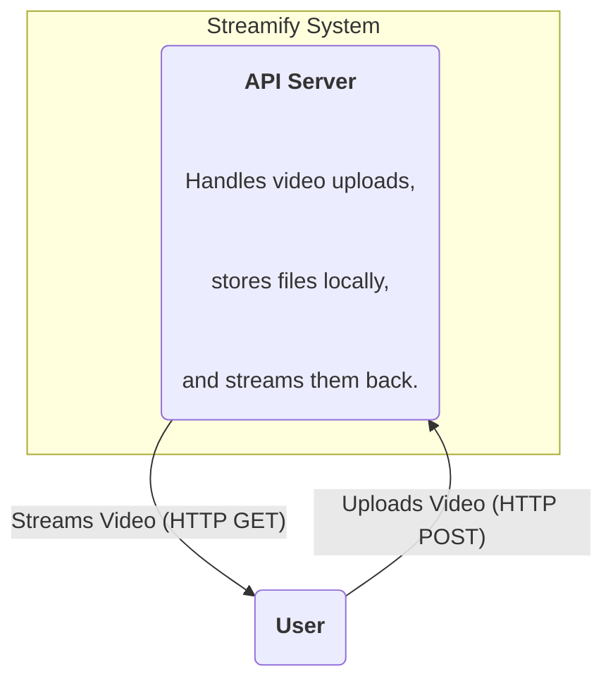
```mermaid
graph TD
    subgraph "Streamify System"
        api_server("
            <b>API Server</b>
            <br>
            Handles video uploads,
            <br>
            stores files locally,
            <br>
            and streams them back.
        ")
    end

    user("<b>User</b>")

    user -- "Uploads Video (HTTP POST)" --> api_server
    api_server -- "Streams Video (HTTP GET)" --> user
```

### **Stage 2: Decouple Storage from the API Server**

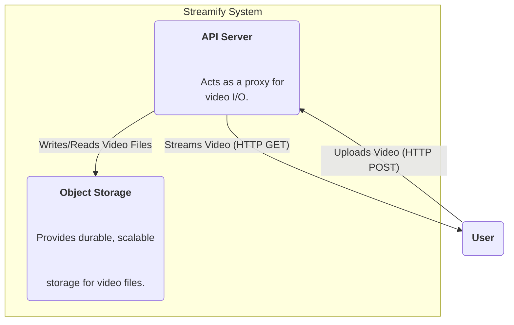
```mermaid
graph TD
    subgraph "Streamify System"
        api_server("
            <b>API Server</b>
            <br>
            Acts as a proxy for video I/O.
        ")

        storage("
            <b>Object Storage</b>
            <br>
            Provides durable, scalable
            <br>
            storage for video files.
        ")

        api_server -- "Writes/Reads Video Files" --> storage
    end

    user("<b>User</b>")

    user -- "Uploads Video (HTTP POST)" --> api_server
    api_server -- "Streams Video (HTTP GET)" --> user
```

### **Stage 3: Implement Direct Uploads via Pre-Signed URLs**

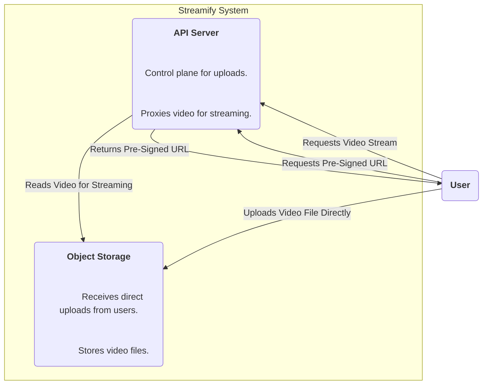
```mermaid
graph TD
    subgraph "Streamify System"
        api_server("
            <b>API Server</b>
            <br>
            Control plane for uploads.
            <br>
            Proxies video for streaming.
        ")

        storage("
            <b>Object Storage</b>
            <br>
            Receives direct uploads from users.
            <br>
            Stores video files.
        ")
        
        api_server -- "Reads Video for Streaming" --> storage
    end

    user("<b>User</b>")

    %% Upload Flow
    user -- "Requests Pre-Signed URL" --> api_server
    api_server -- "Returns Pre-Signed URL" --> user
    user -- "Uploads Video File Directly" --> storage
    
    %% Playback Flow
    user -- "Requests Video Stream" --> api_server
```

### **Stage 4: Introduce an Asynchronous Transcoding Pipeline**

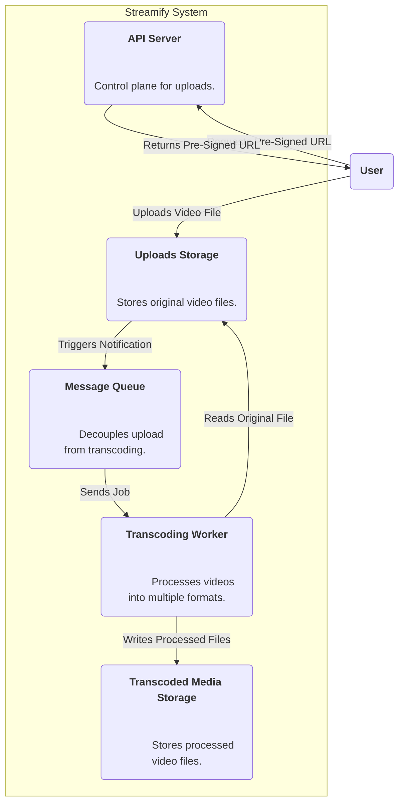
```mermaid
graph TD
    subgraph "Streamify System"
        api_server("
            <b>API Server</b>
            <br>
            Control plane for uploads.
        ")

        uploads_storage("
            <b>Uploads Storage</b>
            <br>
            Stores original video files.
        ")

        message_queue("
            <b>Message Queue</b>
            <br>
            Decouples upload from transcoding.
        ")

        transcoding_worker("
            <b>Transcoding Worker</b>
            <br>
            Processes videos into multiple formats.
        ")
        
        transcoded_storage("
            <b>Transcoded Media Storage</b>
            <br>
            Stores processed video files.
        ")
        
        uploads_storage -- "Triggers Notification" --> message_queue
        message_queue -- "Sends Job" --> transcoding_worker
        transcoding_worker -- "Reads Original File" --> uploads_storage
        transcoding_worker -- "Writes Processed Files" --> transcoded_storage
    end

    user("<b>User</b>")

    user -- "Requests Pre-Signed URL" --> api_server
    api_server -- "Returns Pre-Signed URL" --> user
    user -- "Uploads Video File" --> uploads_storage
```

### **Stage 5: Parallelize Transcoding with a DAG Workflow**

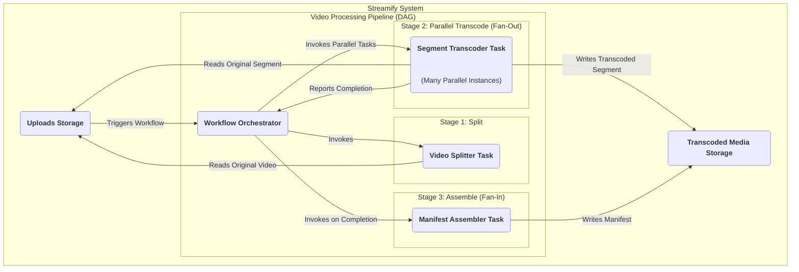
```mermaid
graph TD
    subgraph "Streamify System"
        uploads_storage("<b>Uploads Storage</b>")

        subgraph "Video Processing Pipeline (DAG)"
            orchestrator("<b>Workflow Orchestrator</b>")

            subgraph "Stage 1: Split"
                splitter("<b>Video Splitter Task</b>")
            end

            subgraph "Stage 2: Parallel Transcode (Fan-Out)"
                segment_transcoder("
                    <b>Segment Transcoder Task</b>
                    <br>
                    (Many Parallel Instances)
                ")
            end

            subgraph "Stage 3: Assemble (Fan-In)"
                assembler("<b>Manifest Assembler Task</b>")
            end
        end

        transcoded_storage("<b>Transcoded Media Storage</b>")

        %% Define Workflow
        uploads_storage -- "Triggers Workflow" --> orchestrator
        
        orchestrator -- "Invokes" --> splitter
        splitter -- "Reads Original Video" --> uploads_storage

        orchestrator -- "Invokes Parallel Tasks" --> segment_transcoder
        segment_transcoder -- "Reads Original Segment" --> uploads_storage
        segment_transcoder -- "Writes Transcoded Segment" --> transcoded_storage
        
        segment_transcoder -- "Reports Completion" --> orchestrator
        
        orchestrator -- "Invokes on Completion" --> assembler
        assembler -- "Writes Manifest" --> transcoded_storage
    end
```

### **Stage 6: Implement Adaptive Bitrate Streaming (ABS)**

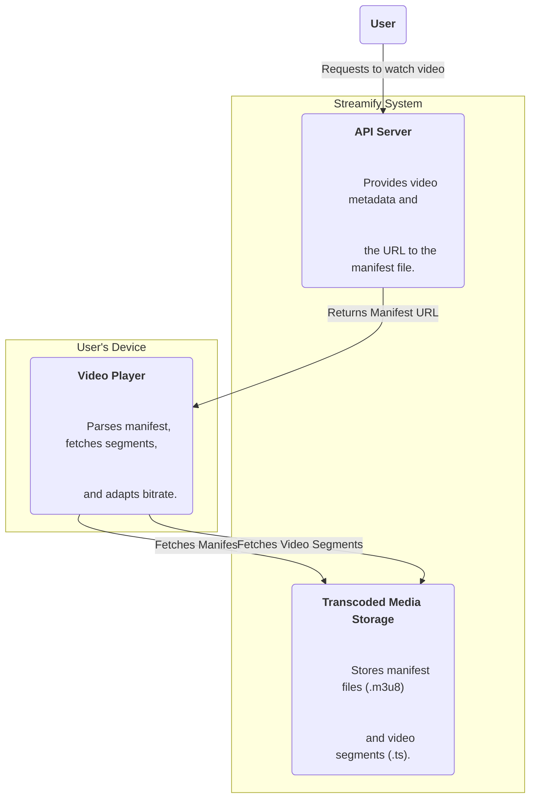
```mermaid
graph TD
    user("<b>User</b>")

    subgraph "Streamify System"
        api_server("
            <b>API Server</b>
            <br>
            Provides video metadata and
            <br>
            the URL to the manifest file.
        ")

        transcoded_storage("
            <b>Transcoded Media Storage</b>
            <br>
            Stores manifest files (.m3u8)
            <br>
            and video segments (.ts).
        ")
    end
    
    subgraph "User's Device"
        video_player("
            <b>Video Player</b>
            <br>
            Parses manifest, fetches segments,
            <br>
            and adapts bitrate.
        ")
    end

    %% Define the playback flow sequentially
    user -- "Requests to watch video" --> api_server
    api_server -- "Returns Manifest URL" --> video_player
    video_player -- "Fetches Manifest" --> transcoded_storage
    video_player -- "Fetches Video Segments" --> transcoded_storage
```

### **Stage 7: Implement Global Content Delivery via CDN**

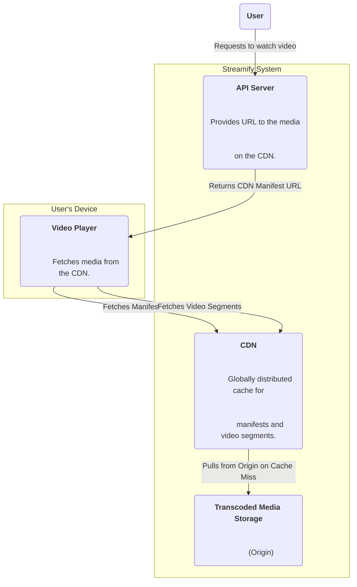
```mermaid
graph TD
    user("<b>User</b>")

    subgraph "Streamify System"
        api_server("
            <b>API Server</b>
            <br>
            Provides URL to the media
            <br>
            on the CDN.
        ")

        cdn("
            <b>CDN</b>
            <br>
            Globally distributed cache for
            <br>
            manifests and video segments.
        ")

        storage("
            <b>Transcoded Media Storage</b>
            <br>
            (Origin)
        ")
    end
    
    subgraph "User's Device"
        video_player("
            <b>Video Player</b>
            <br>
            Fetches media from the CDN.
        ")
    end

    %% Define the playback flow sequentially
    user -- "Requests to watch video" --> api_server
    api_server -- "Returns CDN Manifest URL" --> video_player
    video_player -- "Fetches Manifest" --> cdn
    video_player -- "Fetches Video Segments" --> cdn
    cdn -- "Pulls from Origin on Cache Miss" --> storage
```

### **Stage 8: Achieve High Availability for the Control Plane**

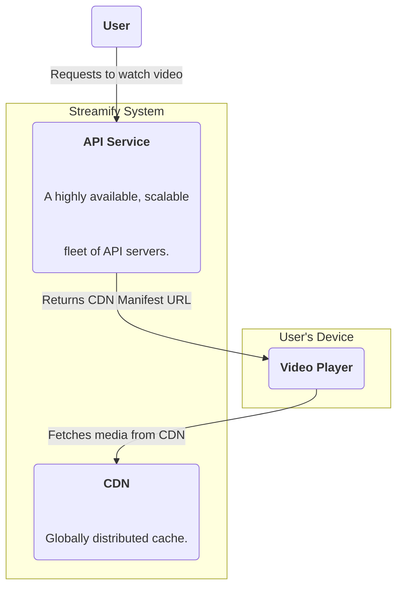
```mermaid
graph TD
    subgraph "User's Device"
        video_player("
            <b>Video Player</b>
        ")
    end

    subgraph "Streamify System"
        api_service("
            <b>API Service</b>
            <br>
            A highly available, scalable
            <br>
            fleet of API servers.
        ")

        cdn("
            <b>CDN</b>
            <br>
            Globally distributed cache.
        ")
    end
    
    user("<b>User</b>")

    user -- "Requests to watch video" --> api_service
    api_service -- "Returns CDN Manifest URL" --> video_player
    video_player -- "Fetches media from CDN" --> cdn
```

### **Stage 9: Implement a Scalable Transcoding Worker Fleet**

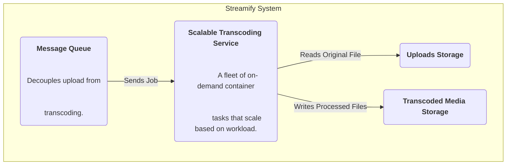
```mermaid
graph TD
    subgraph "Streamify System"
        message_queue("
            <b>Message Queue</b>
            <br>
            Decouples upload from
            <br>
            transcoding.
        ")

        transcoding_service("
            <b>Scalable Transcoding Service</b>
            <br>
            A fleet of on-demand container
            <br>
            tasks that scale based on workload.
        ")
        
        uploads_storage("<b>Uploads Storage</b>")
        transcoded_storage("<b>Transcoded Media Storage</b>")
        
        message_queue -- "Sends Job" --> transcoding_service
        transcoding_service -- "Reads Original File" --> uploads_storage
        transcoding_service -- "Writes Processed Files" --> transcoded_storage
    end
```

### **Stage 10: Implement Resumable Uploads**

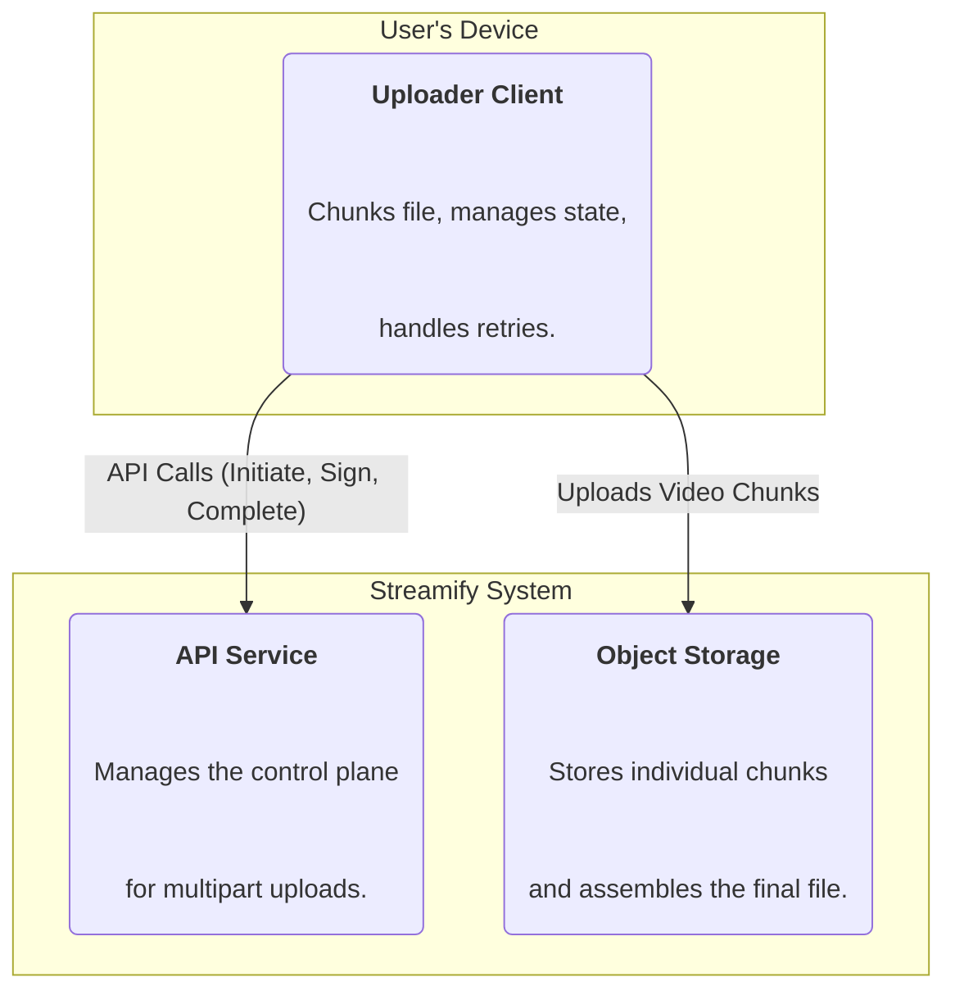
```mermaid
graph TD
    subgraph "User's Device"
        uploader("
            <b>Uploader Client</b>
            <br>
            Chunks file, manages state,
            <br>
            handles retries.
        ")
    end

    subgraph "Streamify System"
        api_service("
            <b>API Service</b>
            <br>
            Manages the control plane
            <br>
            for multipart uploads.
        ")

        storage("
            <b>Object Storage</b>
            <br>
            Stores individual chunks
            <br>
            and assembles the final file.
        ")
    end

    uploader -- "API Calls (Initiate, Sign, Complete)" --> api_service
    uploader -- "Uploads Video Chunks" --> storage
```

### **Stage 11: Add a Metadata Caching Layer**

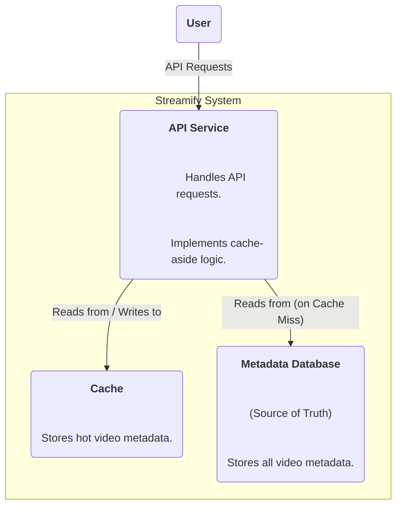
```mermaid
graph TD
    subgraph "Streamify System"
        api_service("
            <b>API Service</b>
            <br>
            Handles API requests.
            <br>
            Implements cache-aside logic.
        ")

        cache("
            <b>Cache</b>
            <br>
            Stores hot video metadata.
        ")

        database("
            <b>Metadata Database</b>
            <br>
            (Source of Truth)
            <br>
            Stores all video metadata.
        ")

        api_service -- "Reads from / Writes to" --> cache
        api_service -- "Reads from (on Cache Miss)" --> database
    end

    user("<b>User</b>")
    user -- "API Requests" --> api_service
```

### **Overall Logical View (C4 Component Diagram)**

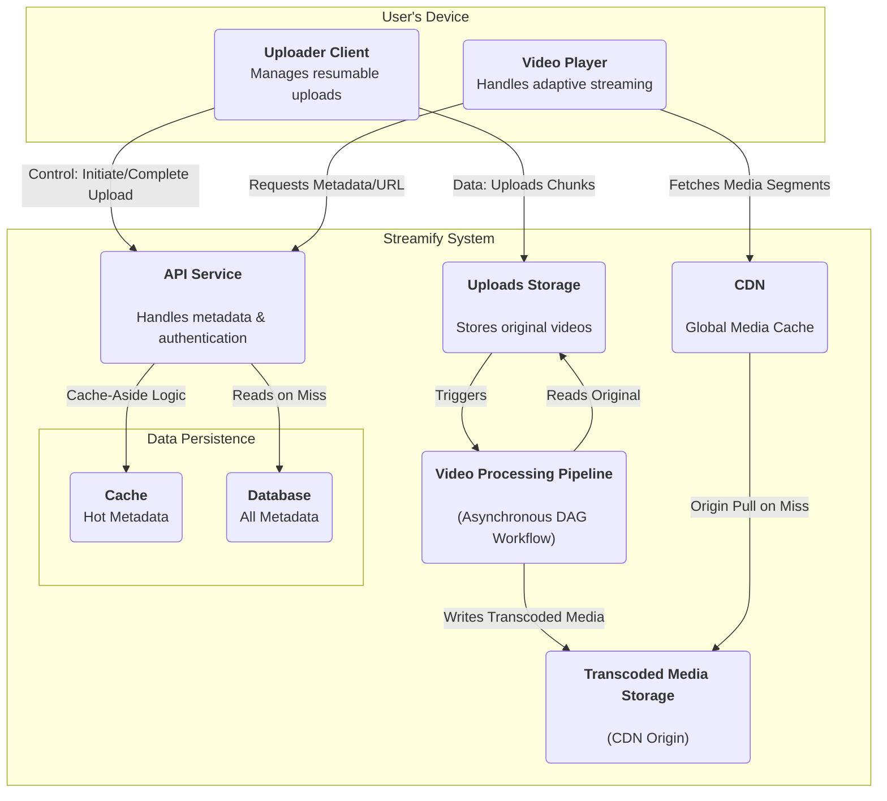
```mermaid
graph TD
    subgraph "User's Device"
        direction LR
        uploader("<b>Uploader Client</b><br>Manages resumable uploads")
        video_player("<b>Video Player</b><br>Handles adaptive streaming")
    end

    subgraph "Streamify System"
        api_service("
            <b>API Service</b>
            <br>Handles metadata & authentication
        ")

        subgraph "Data Persistence"
            direction LR
            cache("<b>Cache</b><br>Hot Metadata")
            database("<b>Database</b><br>All Metadata")
        end

        uploads_storage("
            <b>Uploads Storage</b>
            <br>Stores original videos
        ")
        
        processing_pipeline("
            <b>Video Processing Pipeline</b>
            <br>(Asynchronous DAG Workflow)
        ")

        transcoded_storage("
            <b>Transcoded Media Storage</b>
            <br>(CDN Origin)
        ")
        
        cdn("
            <b>CDN</b>
            <br>Global Media Cache
        ")
    end

    %% User Flows
    uploader -- "Control: Initiate/Complete Upload" --> api_service
    uploader -- "Data: Uploads Chunks" --> uploads_storage
    
    video_player -- "Requests Metadata/URL" --> api_service
    video_player -- "Fetches Media Segments" --> cdn

    %% Internal System Flows
    api_service -- "Cache-Aside Logic" --> cache
    api_service -- "Reads on Miss" --> database
    
    uploads_storage -- "Triggers" --> processing_pipeline
    processing_pipeline -- "Reads Original" --> uploads_storage
    processing_pipeline -- "Writes Transcoded Media" --> transcoded_storage
    
    cdn -- "Origin Pull on Miss" --> transcoded_storage
```

## Physical View (AWS Deployment Diagram)

### **Stage 1: Foundational Monolithic Service**

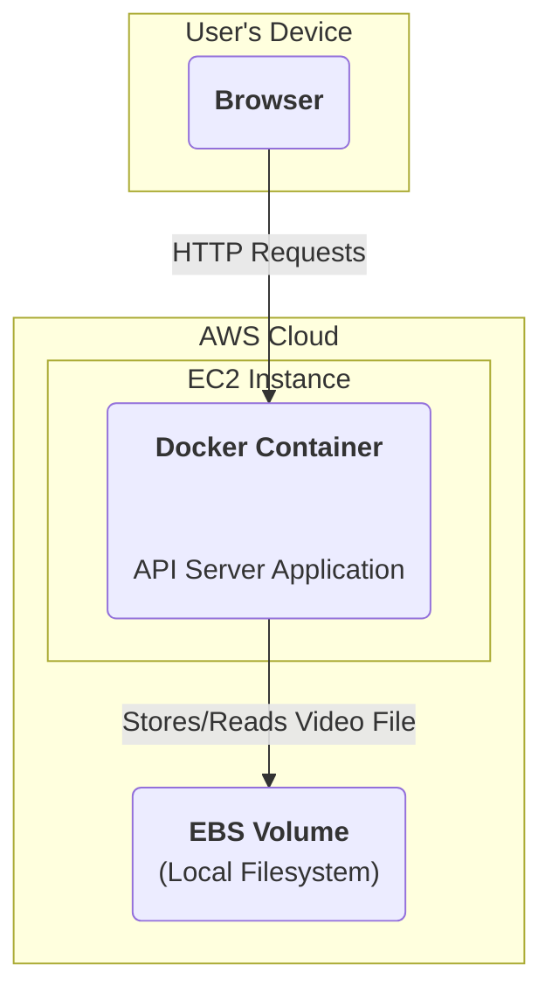
```mermaid
graph TD
    subgraph "User's Device"
        browser("<b>Browser</b>")
    end

    subgraph "AWS Cloud"
        subgraph "EC2 Instance"
            direction TB
            container("
                <b>Docker Container</b>
                <br>
                API Server Application
            ")
        end
        
        ebs("<b>EBS Volume</b><br>(Local Filesystem)")

        container -- "Stores/Reads Video File" --> ebs
    end
    
    browser -- "HTTP Requests" --> container
```

### **Stage 2: Decouple Storage from the API Server**

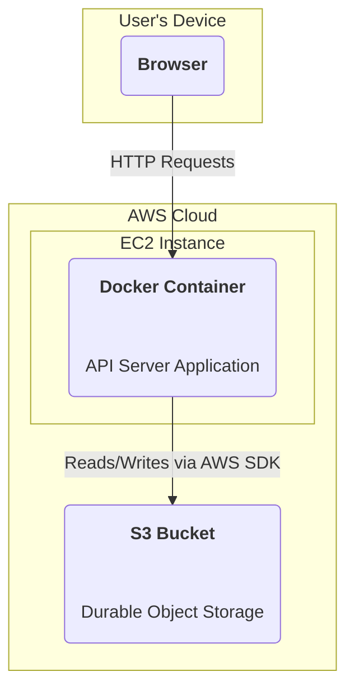
```mermaid
graph TD
    subgraph "User's Device"
        browser("<b>Browser</b>")
    end

    subgraph "AWS Cloud"
        subgraph "EC2 Instance"
            container("
                <b>Docker Container</b>
                <br>
                API Server Application
            ")
        end
        
        s3("
            <b>S3 Bucket</b>
            <br>
            Durable Object Storage
        ")

        container -- "Reads/Writes via AWS SDK" --> s3
    end
    
    browser -- "HTTP Requests" --> container
```

### **Stage 3: Implement Direct Uploads via Pre-Signed URLs**

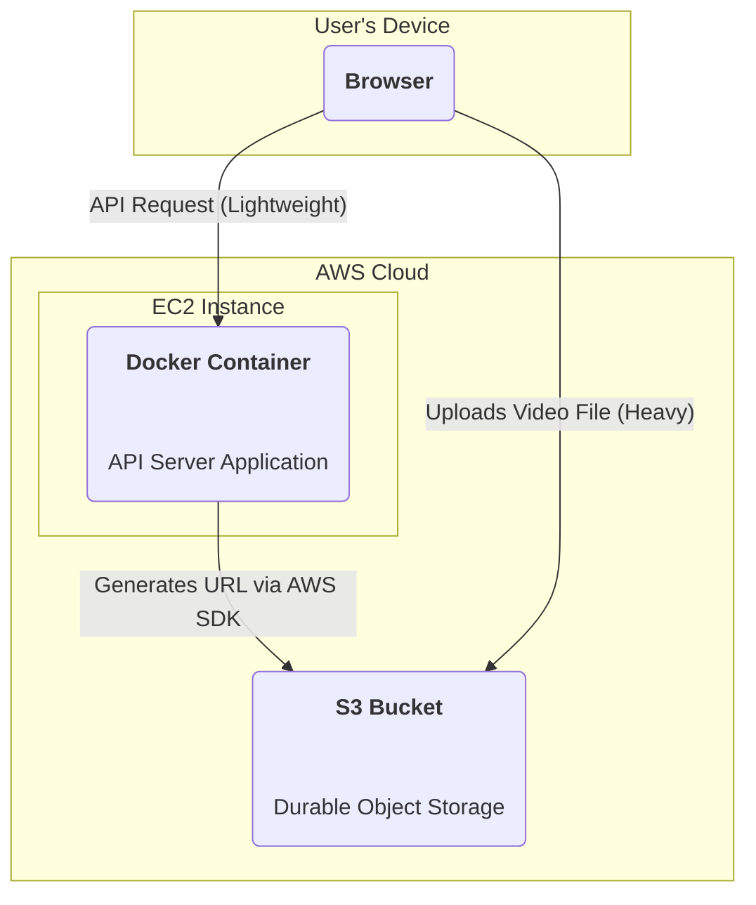
```mermaid
graph TD
    subgraph "User's Device"
        browser("<b>Browser</b>")
    end

    subgraph "AWS Cloud"
        subgraph "EC2 Instance"
            container("
                <b>Docker Container</b>
                <br>
                API Server Application
            ")
        end
        
        s3("
            <b>S3 Bucket</b>
            <br>
            Durable Object Storage
        ")

        container -- "Generates URL via AWS SDK" --> s3
    end
    
    browser -- "API Request (Lightweight)" --> container
    browser -- "Uploads Video File (Heavy)" --> s3
```

### **Stage 4: Introduce an Asynchronous Transcoding Pipeline**

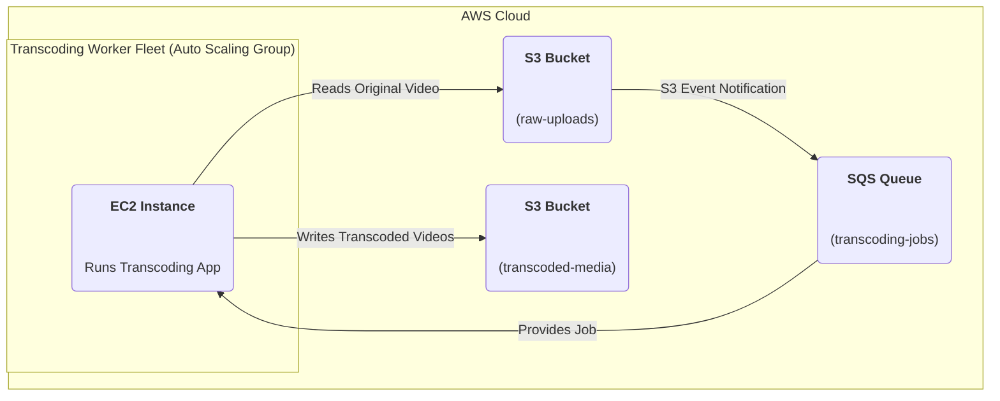
```mermaid
graph TD
    subgraph "AWS Cloud"
        s3_uploads("
            <b>S3 Bucket</b>
            <br>
            (raw-uploads)
        ")

        sqs("
            <b>SQS Queue</b>
            <br>
            (transcoding-jobs)
        ")

        subgraph "Transcoding Worker Fleet (Auto Scaling Group)"
            worker_instance("
                <b>EC2 Instance</b>
                <br>
                Runs Transcoding App
            ")
        end

        s3_transcoded("
            <b>S3 Bucket</b>
            <br>
            (transcoded-media)
        ")
        
        %% Define the process flow
        s3_uploads -- "S3 Event Notification" --> sqs
        sqs -- "Provides Job" --> worker_instance
        worker_instance -- "Reads Original Video" --> s3_uploads
        worker_instance -- "Writes Transcoded Videos" --> s3_transcoded
    end
```

### **Stage 5:Parallelize Transcoding with a DAG Workflow**

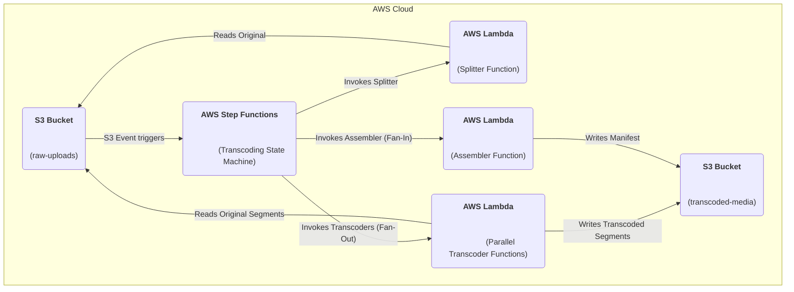
```mermaid
graph TD
    subgraph "AWS Cloud"
        s3_uploads("
            <b>S3 Bucket</b>
            <br>
            (raw-uploads)
        ")

        step_functions("
            <b>AWS Step Functions</b>
            <br>
            (Transcoding State Machine)
        ")

        lambda_splitter("
            <b>AWS Lambda</b>
            <br>
            (Splitter Function)
        ")

        lambda_transcoder("
            <b>AWS Lambda</b>
            <br>
            (Parallel Transcoder Functions)
        ")
        
        lambda_assembler("
            <b>AWS Lambda</b>
            <br>
            (Assembler Function)
        ")

        s3_transcoded("
            <b>S3 Bucket</b>
            <br>
            (transcoded-media)
        ")

        %% Control Flow
        s3_uploads -- "S3 Event triggers" --> step_functions
        step_functions -- "Invokes Splitter" --> lambda_splitter
        step_functions -- "Invokes Transcoders (Fan-Out)" --> lambda_transcoder
        step_functions -- "Invokes Assembler (Fan-In)" --> lambda_assembler

        %% Data Flow
        lambda_splitter -- "Reads Original" --> s3_uploads
        lambda_transcoder -- "Reads Original Segments" --> s3_uploads
        lambda_transcoder -- "Writes Transcoded Segments" --> s3_transcoded
        lambda_assembler -- "Writes Manifest" --> s3_transcoded
    end
```

### **Stage 6: Implement Adaptive Bitrate Streaming (ABS)**

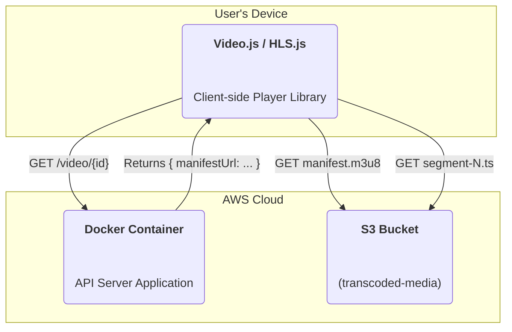
```mermaid
graph TD
    subgraph "User's Device"
        player_lib("
            <b>Video.js / HLS.js</b>
            <br>
            Client-side Player Library
        ")
    end

    subgraph "AWS Cloud"
        api_container("
            <b>Docker Container</b>
            <br>
            API Server Application
        ")
        
        s3_transcoded("
            <b>S3 Bucket</b>
            <br>
            (transcoded-media)
        ")
    end
    
    player_lib -- "GET /video/{id}" --> api_container
    api_container -- "Returns { manifestUrl: ... }" --> player_lib
    player_lib -- "GET manifest.m3u8" --> s3_transcoded
    player_lib -- "GET segment-N.ts" --> s3_transcoded
```

### **Stage 7: Implement Global Content Delivery via CDN**

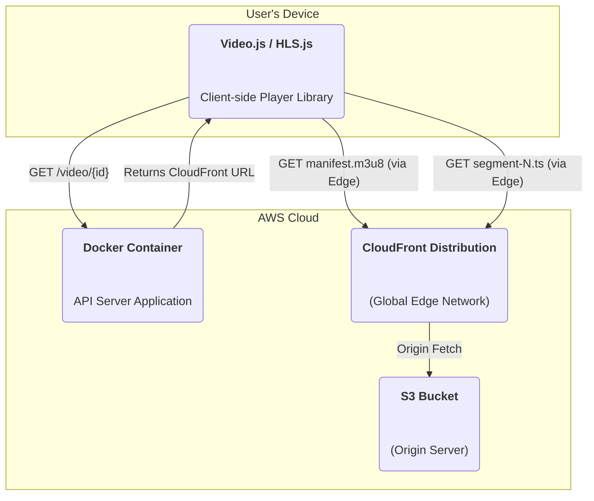
```mermaid
graph TD
    subgraph "User's Device"
        player_lib("
            <b>Video.js / HLS.js</b>
            <br>
            Client-side Player Library
        ")
    end

    subgraph "AWS Cloud"
        api_container("
            <b>Docker Container</b>
            <br>
            API Server Application
        ")
        
        cloudfront("
            <b>CloudFront Distribution</b>
            <br>
            (Global Edge Network)
        ")

        s3_transcoded("
            <b>S3 Bucket</b>
            <br>
            (Origin Server)
        ")
        
        cloudfront -- "Origin Fetch" --> s3_transcoded
    end
    
    player_lib -- "GET /video/{id}" --> api_container
    api_container -- "Returns CloudFront URL" --> player_lib
    player_lib -- "GET manifest.m3u8 (via Edge)" --> cloudfront
    player_lib -- "GET segment-N.ts (via Edge)" --> cloudfront
```

### **Stage 8: Achieve High Availability for the Control Plane**

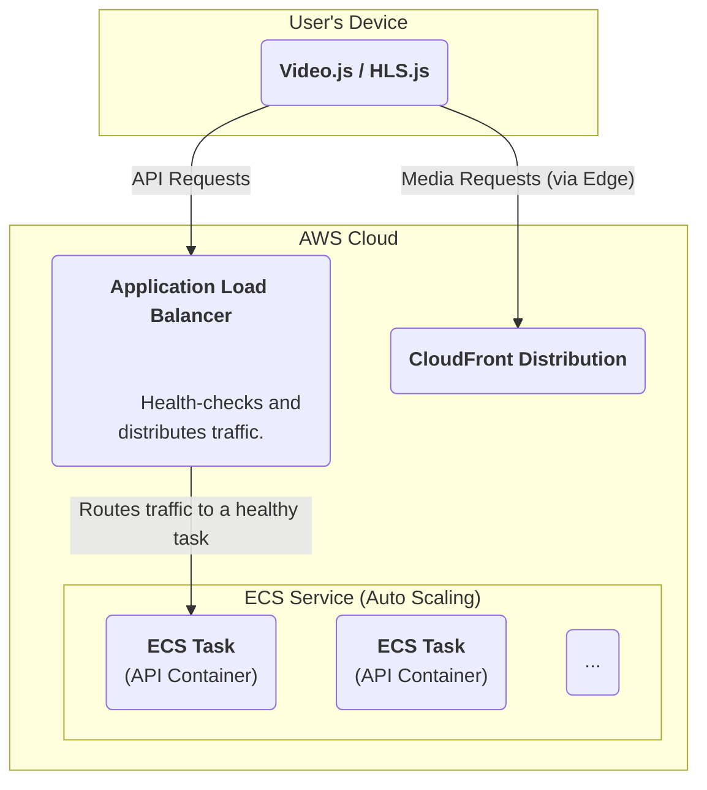
```mermaid
graph TD
    subgraph "User's Device"
        player_lib("
            <b>Video.js / HLS.js</b>
        ")
    end

    subgraph "AWS Cloud"
        alb("
            <b>Application Load Balancer</b>
            <br>
            Health-checks and distributes traffic.
        ")

        subgraph "ECS Service (Auto Scaling)"
            direction LR
            task1("<b>ECS Task</b><br>(API Container)")
            task2("<b>ECS Task</b><br>(API Container)")
            task3("...")
        end
        
        cloudfront("
            <b>CloudFront Distribution</b>
        ")
    end
    
    player_lib -- "API Requests" --> alb
    alb -- "Routes traffic to a healthy task" --> task1
    
    player_lib -- "Media Requests (via Edge)" --> cloudfront
```

### **Stage 9: Implement a Scalable Transcoding Worker Fleet**

```mermaid
graph TD
    subgraph "AWS Cloud"
        sqs("
            <b>SQS Queue</b>
            <br>
            (transcoding-jobs)
        ")

        subgraph "ECS Service (Fargate with Auto Scaling)"
            fargate_tasks("
                <b>Fargate Tasks</b>
                <br>
                (Transcoder Containers)
            ")
        end
        
        s3_uploads("<b>S3 Bucket</b><br>(raw-uploads)")
        s3_transcoded("<b>S3 Bucket</b><br>(transcoded-media)")

        %% Control Flow: The number of messages in the queue drives the scaling of the Fargate tasks.
        sqs -- "Queue depth triggers scaling of" --> fargate_tasks

        %% Data Flow: The tasks read from one bucket and write to another.
        fargate_tasks -- "Read Original Video" --> s3_uploads
        fargate_tasks -- "Write Transcoded Videos" --> s3_transcoded
    end
```

### **Stage 10: Implement Resumable Uploads**

```mermaid
graph TD
    subgraph "User's Device"
        uploader_lib("
            <b>Uploader Library</b>
            <br>
            (e.g., Uppy, custom SDK)
        ")
    end

    subgraph "AWS Cloud"
        alb("
            <b>Application Load Balancer</b>
        ")

        ecs_service("
            <b>ECS Service (Auto Scaling)</b>
            <br>
            API Container Tasks
        ")
        
        s3("
            <b>S3 Bucket</b>
        ")
    end
    
    %% Control Plane Flow
    uploader_lib -- "API Calls (Initiate, Sign, Complete)" --> alb
    alb -- "Routes to Task" --> ecs_service
    ecs_service -- "Manages Upload Lifecycle via SDK" --> s3

    %% Data Plane Flow
    uploader_lib -- "Uploads Chunks via Pre-Signed URL" --> s3
```

### **Stage 11: Add a Metadata Caching Layer**

```mermaid
graph TD
    subgraph "AWS Cloud"
        alb("
            <b>Application Load Balancer</b>
        ")

        subgraph "ECS Service (Auto Scaling)"
            api_task("<b>ECS Task</b><br>(API Container)")
        end
        
        redis("
            <b>ElastiCache for Redis</b>
            <br>
            (In-Memory Cache Cluster)
        ")

        rds("
            <b>RDS Database</b>
            <br>
            (e.g., PostgreSQL)
        ")
        
        alb --> api_task
        api_task -- "GET/SET (Cache)" --> redis
        api_task -- "SELECT (on Cache Miss)" --> rds
    end
```

### **Overall Physical View (AWS Deployment Diagram)**

```mermaid
graph TD
    %% --- User's Device ---
    subgraph "User's Device"
        direction LR
        uploader("<b>Uploader Library</b><br>(e.g., Uppy)")
        player("<b>Video Player Library</b><br>(e.g., HLS.js)")
    end

    %% --- AWS Cloud ---
    subgraph "AWS Cloud"
        %% API & Persistence are closely linked
        subgraph "API & Data Persistence"
            direction TB
            alb("<b>Application Load Balancer</b>")
            ecs_api("<b>ECS Service (Fargate)</b><br>API Container Tasks")
            
            subgraph "Persistence Layer"
                direction LR
                redis("<b>ElastiCache for Redis</b>")
                rds("<b>RDS Database</b>")
            end
            
            alb --> ecs_api
            ecs_api -- "Cache-Aside Logic" --> redis
            ecs_api -- "Reads/Writes" --> rds
        end

        %% Processing is a distinct flow
        subgraph "Asynchronous Video Processing"
            direction TB
            s3_uploads("<b>S3 Bucket (raw-uploads)</b>")
            sfn("<b>AWS Step Functions (DAG)</b>")
            s3_uploads -- "S3 Event Triggers" --> sfn
        end

        %% Delivery is a distinct flow
        subgraph "Content Delivery Network (CDN)"
            direction TB
            s3_transcoded("<b>S3 Bucket (transcoded-media / Origin)</b>")
            cloudfront("<b>CloudFront Distribution</b>")
            cloudfront -- "Origin Pull" --> s3_transcoded
        end
    end

    %% --- Interactions between Subgraphs ---
    
    %% Upload Flow
    uploader -- "Control: Initiate/Sign/Complete" --> alb
    uploader -- "Data: Uploads Chunks" --> s3_uploads

    %% Playback Flow
    player -- "API: Get Metadata/URL" --> alb
    player -- "Data: Fetches Media" --> cloudfront
    
    %% Internal Processing Flow
    sfn -- "Orchestrates workers to read from" --> s3_uploads
    sfn -- "Orchestrates workers to write to" --> s3_transcoded
```
