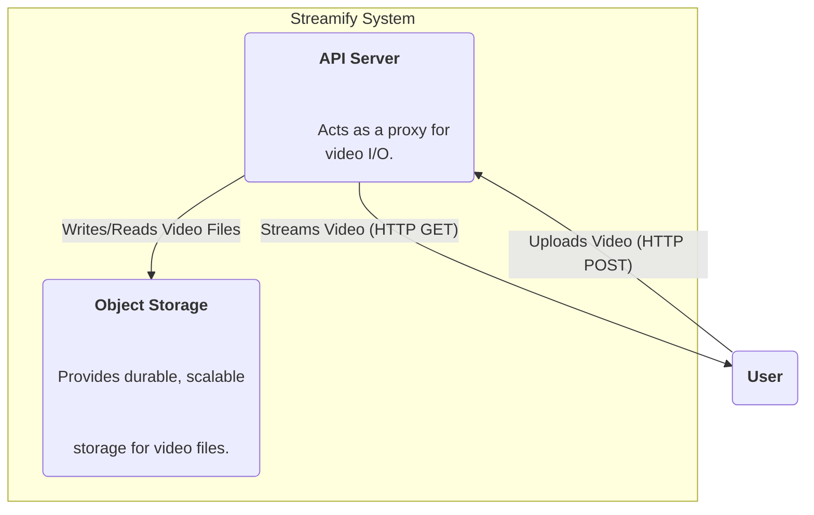
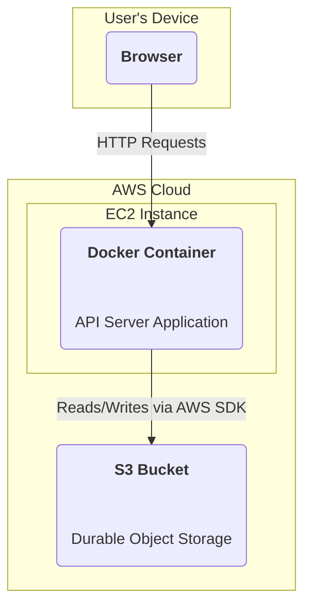

### **Decouple Storage from the API Server**

Problem:
The API server's local filesystem (EBS Volume) is a single point of failure and is not scalable or durable. If the server instance fails, all stored video data is at high risk of being lost. Furthermore, the storage capacity is limited to the size of the attached volume.

Solution:
Introduce a dedicated, highly durable, and scalable object storage service. The API server's role will be modified: it will receive the uploaded video file from the user and then stream it to the object storage bucket. For playback, the server will fetch the file from object storage and stream it back to the user. This decouples the application logic from the storage medium.

Trade-offs:
- Pro: Massively improves data durability and provides virtually unlimited storage scalability (NFR2). It separates concerns, which is a core principle of good architecture.
- Con: The API server remains a critical bottleneck for all video I/O traffic. All uploaded and streamed data must still pass through the server's network interface, limiting the system's overall throughput.

### **Logical View (C4 Component Diagram)**

### **Physical View (AWS Deployment Diagram)**

### **Component-to-Resource Mapping Table**

| Logical Component | Physical Resource                                     | Rationale                                                                                                                                                             |
| :---------------- | :---------------------------------------------------- | :-------------------------------------------------------------------------------------------------------------------------------------------------------------------- |
| API Server        | A Docker container running on a single AWS EC2 Instance. | The API server remains the single entry point. Its deployment model is unchanged for now.                                                                            |
| Object Storage    | AWS Simple Storage Service (S3)                         | S3 is the industry standard for object storage, offering 11 nines of durability, virtually infinite scalability, and a cost-effective pay-as-you-go pricing model. It perfectly matches our non-functional requirements for durability and scalability. |
