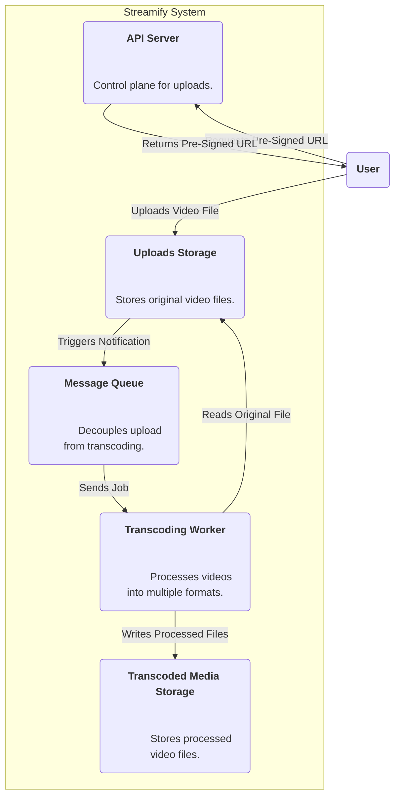
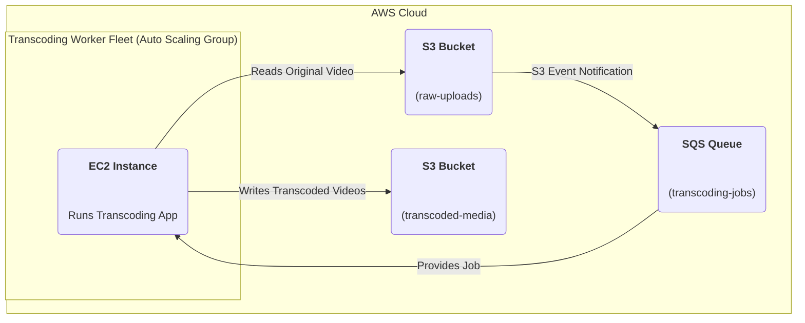

### **Introduce an Asynchronous Transcoding Pipeline**

Problem:
A single, original video file is not suitable for all users due to varying device capabilities and network speeds. The system needs a way to convert the original upload into multiple formats and resolutions, but doing this synchronously during the upload process would be extremely slow and make the user wait an unacceptably long time.

Solution:
Create a decoupled, asynchronous transcoding pipeline. When a video is successfully uploaded to a dedicated "uploads" bucket, an event is automatically triggered. This event sends a message containing the video's location to a message queue. A separate fleet of "Transcoding Workers" listens to this queue, picks up the messages, downloads the original video, processes it into multiple formats/resolutions (e.g., 1080p, 720p, 480p), and saves the resulting files to a separate "transcoded-media" bucket.

Trade-offs:
- Pro: Creates a robust, scalable, and highly responsive system. The user's upload is confirmed instantly, and the heavy processing happens in the background. This adheres to the non-functional requirement for efficiency (NFR5).
- Con: Introduces new components and complexity, including a message queue and a new worker service. This requires careful monitoring to ensure the pipeline doesn't get backlogged.

### **Logical View (C4 Component Diagram)**

### **Physical View (AWS Deployment Diagram)**

### **Component-to-Resource Mapping Table**

| Logical Component        | Physical Resource                                                                | Rationale                                                                                                                                                                                                                         |
| :----------------------- | :------------------------------------------------------------------------------- | :-------------------------------------------------------------------------------------------------------------------------------------------------------------------------------------------------------------------------------- |
| Uploads Storage          | AWS S3 Bucket (e.g., `raw-uploads`)                                                  | A dedicated bucket to store the original, unmodified video files.                                                                                                                                                                 |
| Message Queue            | AWS Simple Queue Service (SQS)                                                     | SQS is a fully managed message queuing service that is perfect for decoupling services. S3 Event Notifications can integrate directly with it, making it an ideal choice to trigger the asynchronous workflow reliably.                 |
| Transcoding Worker       | An Auto Scaling Group of EC2 Instances running the transcoding application.      | A separate fleet of compute resources is needed for the CPU-intensive transcoding tasks. An Auto Scaling Group allows the fleet to grow or shrink based on the workload (i.e., the number of messages in the SQS queue), optimizing costs. |
| Transcoded Media Storage | AWS S3 Bucket (e.g., `transcoded-media`)                                             | A separate bucket to store the output of the transcoding process. This separation keeps the original files safe and simplifies access control and lifecycle management for the different types of data.                               |
