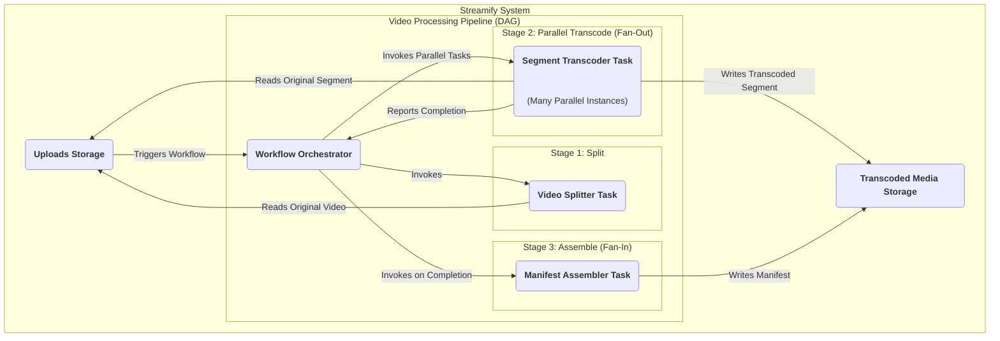
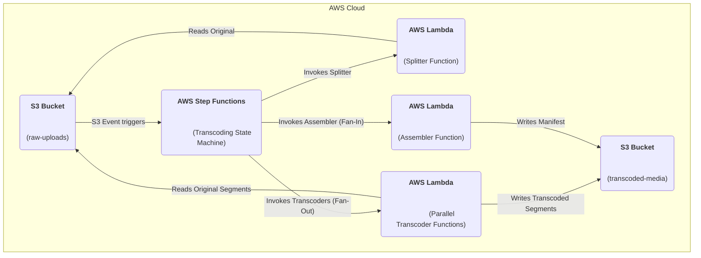

### **Parallelize Transcoding with a DAG Workflow**

Problem:
Processing a long video file into many different formats and resolutions sequentially is very slow, even with a decoupled worker. A single worker handling a one-hour 4K video could take a significant amount of time, creating a long delay before the video is available for viewing and violating our low latency and efficiency requirements.

Solution:
Model the transcoding process as a Directed Acyclic Graph (DAG) and manage it with a workflow orchestrator. This "fan-out/fan-in" pattern breaks the problem into smaller, parallelizable tasks:
1.  **Split:** A "splitter" task first divides the original video into small, independent segments (e.g., 10 seconds each).
2.  **Fan-Out (Parallel Transcode):** The orchestrator triggers hundreds of parallel worker instances simultaneously. Each worker is responsible for transcoding just one small segment into one target resolution (e.g., worker#12 handles segment#4 for 720p).
3.  **Fan-In (Assemble):** Once all segments for all resolutions are confirmed complete, a final "assembler" task runs to generate the master manifest files that point to all the newly transcoded segments.

Trade-offs:
- Pro: This massively parallel approach drastically reduces the total video processing time from potentially hours to minutes (NFR5), making content available much faster. It is extremely scalable.
- Con: Introduces a new, stateful orchestration service, which adds significant architectural complexity. Managing, monitoring, and debugging a distributed workflow is more challenging than a simple queue-based system.

### **Logical View (C4 Component Diagram)**

### **Physical View (AWS Deployment Diagram)**

### **Component-to-Resource Mapping Table**

| Logical Component         | Physical Resource                                 | Rationale                                                                                                                                                                                                                                                         |
| :------------------------ | :------------------------------------------------ | :---------------------------------------------------------------------------------------------------------------------------------------------------------------------------------------------------------------------------------------------------------------- |
| Workflow Orchestrator     | AWS Step Functions                                | Step Functions is a serverless workflow orchestrator designed specifically for managing complex, stateful DAGs. It handles state, error handling, and parallel execution ("Map State"), making it a perfect fit for our fan-out/fan-in transcoding model. |
| Video Splitter Task       | AWS Lambda Function                               | Splitting a video file is a short-lived, event-driven task. Lambda provides a cost-effective, serverless compute model that can scale instantly without managing servers.                                                                                    |
| Segment Transcoder Task   | AWS Lambda Function                               | Transcoding small segments is an ideal use case for Lambda. We can run thousands of parallel Lambda invocations simultaneously, one for each segment/resolution pair, achieving massive parallelization without managing any EC2 instances.          |
| Manifest Assembler Task   | AWS Lambda Function                               | Generating a text-based manifest file is a very fast operation, making it a perfect final step in the Lambda-based workflow.                                                                                                                                     |
