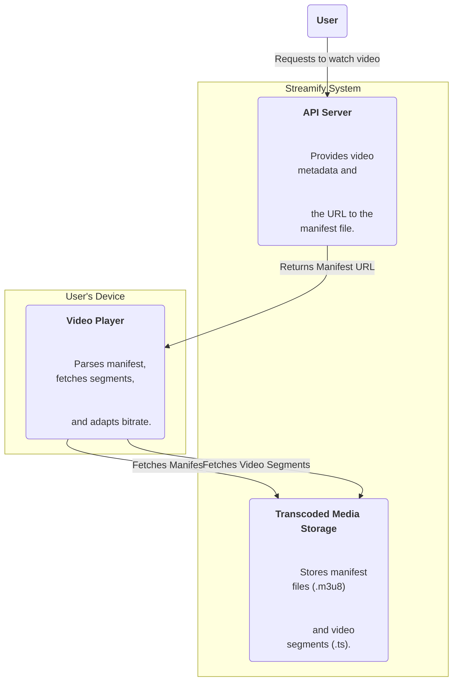
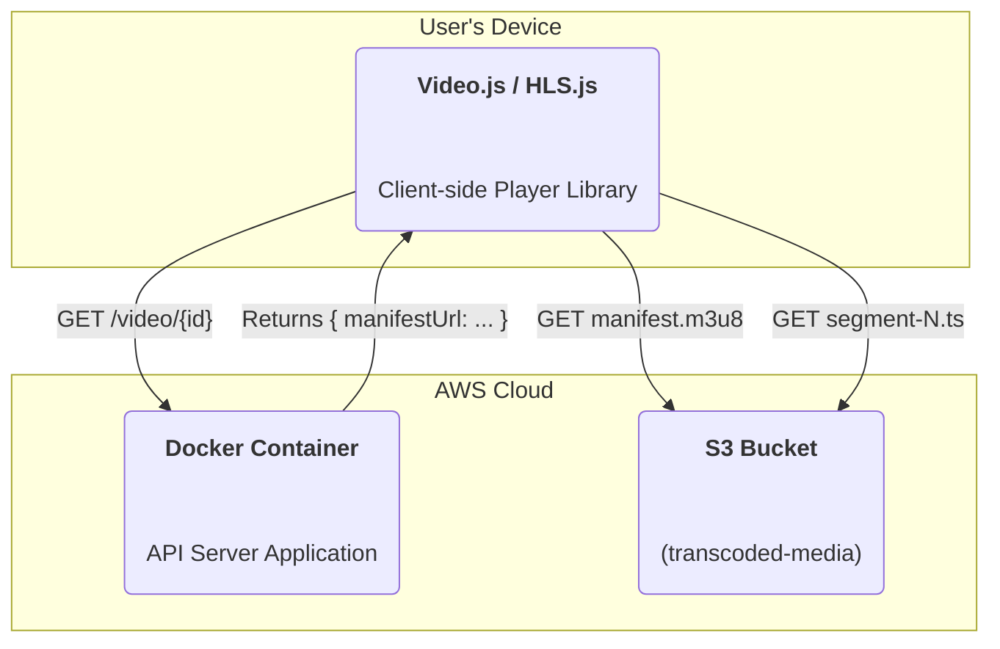

### **Implement Adaptive Bitrate Streaming (ABS)**

Problem:
The system can now transcode a video into multiple resolutions and store them as segments, but there is no mechanism to serve this to the end-user in a way that allows for dynamic quality switching. A client-side player needs a "map" of all the available streams and segments to provide a seamless adaptive bitrate experience.

Solution:
Implement an industry-standard manifest-based streaming protocol like HTTP Live Streaming (HLS). The "Manifest Assembler" task from the previous workflow will be responsible for creating a master manifest file (e.g., `.m3u8`). This manifest contains metadata about all available streams (resolutions, bitrates, codecs) and points to the individual segment files. The API server's role will shift to providing a URL to this manifest file. A compatible Video Player on the client-side will then read this manifest and handle the logic of fetching the appropriate video segments and switching between quality levels based on network conditions.

Trade-offs:
- Pro: Enables a true Adaptive Bitrate Streaming experience (FR4), which is the core of modern video platforms. This provides a smooth, high-quality viewing experience for the user. It also prepares the architecture for CDN integration by making the content simple static files.
- Con: Requires a more sophisticated client-side video player capable of parsing HLS/DASH manifests. The storage footprint increases slightly due to the manifest files themselves.

### **Logical View (C4 Component Diagram)**

### **Physical View (AWS Deployment Diagram)**

### **Component-to-Resource Mapping Table**

| Logical Component        | Physical Resource                                                                | Rationale                                                                                                                                                                                                                                               |
| :----------------------- | :------------------------------------------------------------------------------- | :------------------------------------------------------------------------------------------------------------------------------------------------------------------------------------------------------------------------------------------------------ |
| Video Player             | A client-side JavaScript library (e.g., Video.js, HLS.js, or Shaka Player) running in the user's browser. | These libraries provide robust, pre-built functionality for parsing HLS/DASH manifests and implementing the adaptive bitrate switching logic. Using a standard library is far more reliable and efficient than building this complex logic from scratch. |
| API Server               | A Docker container running on an AWS EC2 Instance.                                 | The API server is now removed from the high-bandwidth video streaming data path. Its role is simplified to serving metadata and the initial URL for the manifest file, which is a very lightweight and scalable task.                    |
| Transcoded Media Storage | AWS S3 Bucket (e.g., `transcoded-media`)                                             | The S3 bucket now serves both the manifest files and video segments as simple static assets directly to the client's browser. This is a highly scalable and cost-effective way to deliver the content.                                      |
