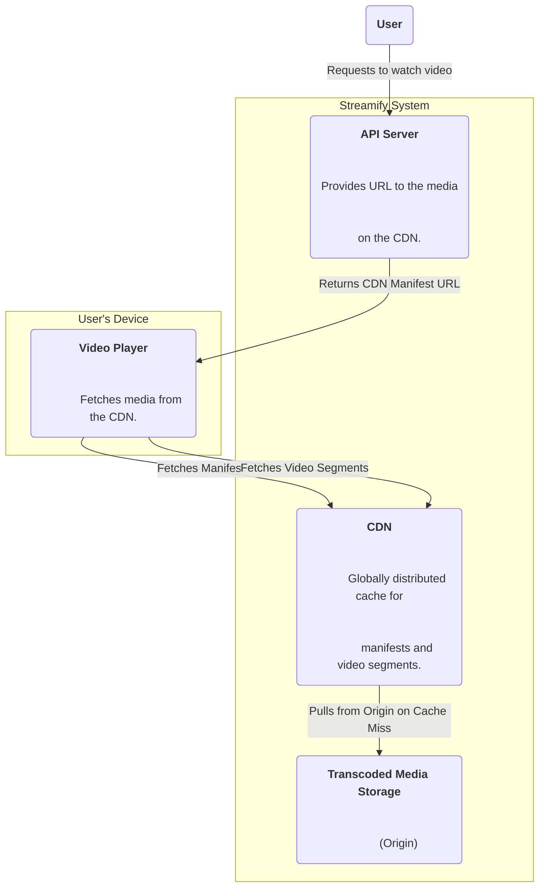
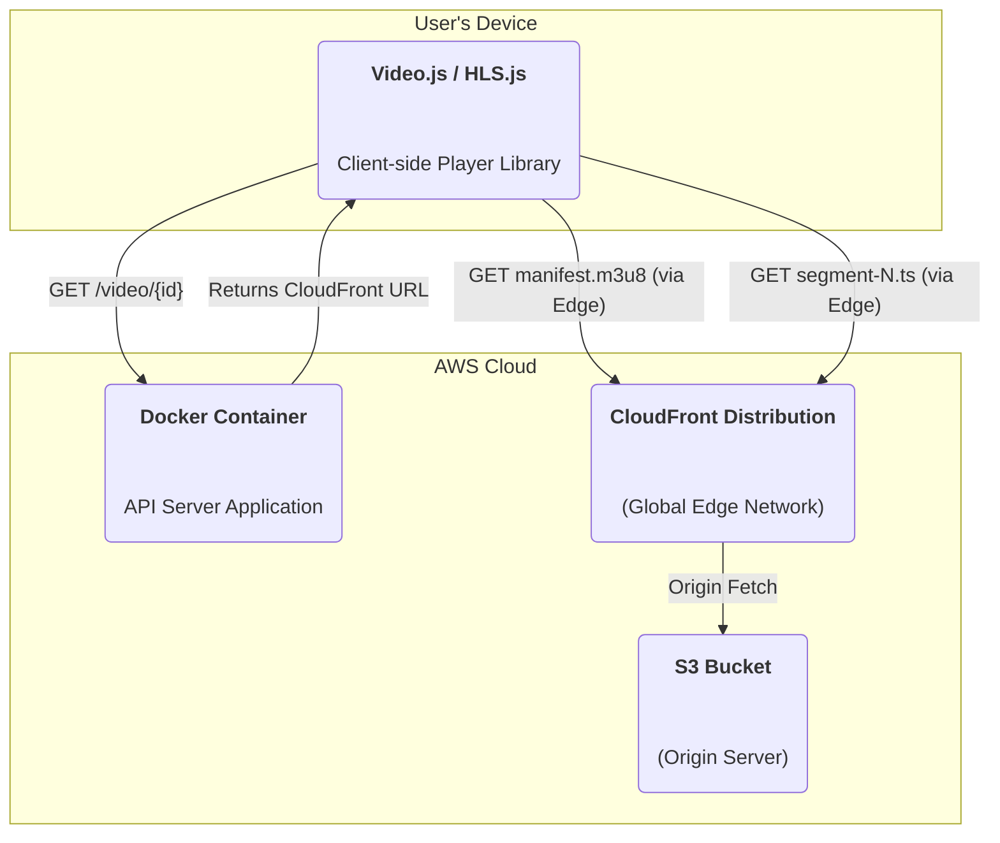

### **Implement Global Content Delivery via CDN**

Problem:
Users who are geographically distant from the AWS region where the S3 bucket is located will experience high latency. This results in slow video start times and potential buffering, as the video segments must travel long distances over the public internet.

Solution:
Introduce a Content Delivery Network (CDN) to act as a global caching layer. The transcoded media in the S3 bucket will be designated as the "origin." The CDN will pull the manifest and video segments from this origin and distribute copies to a worldwide network of "edge servers." When a user requests to watch a video, their player will be transparently routed to the geographically closest edge server, which serves the content from its local cache, dramatically reducing latency.

Trade-offs:
- Pro: Massively improves global performance, providing low-latency streaming for all users (NFR6). Significantly reduces the read load and data transfer costs from the S3 origin for popular content.
- Con: Adds a new service with its own cost structure (per-request and data transfer out). Introduces a caching layer that requires management, particularly for cache invalidation if content needs to be updated or removed quickly.

### **Logical View (C4 Component Diagram)**

### **Physical View (AWS Deployment Diagram)**

### **Component-to-Resource Mapping Table**

| Logical Component        | Physical Resource                                                                | Rationale                                                                                                                                                                                                                         |
| :----------------------- | :------------------------------------------------------------------------------- | :-------------------------------------------------------------------------------------------------------------------------------------------------------------------------------------------------------------------------------- |
| Video Player             | A client-side JavaScript library (e.g., Video.js, HLS.js).                         | No change. The player library transparently fetches content from the URL it is given, which will now be a CDN URL.                                                                                                                |
| API Server               | A Docker container running on an AWS EC2 Instance.                                 | The server's logic is updated to construct and return URLs pointing to the CloudFront distribution instead of directly to the S3 bucket.                                                                                        |
| **CDN**                  | **AWS CloudFront**                                                               | **CloudFront is AWS's global CDN. It integrates seamlessly with S3 as an origin and provides the low-latency, high-throughput delivery required for video streaming, fulfilling our global delivery requirement (NFR6).**            |
| Transcoded Media Storage | AWS S3 Bucket (e.g., `transcoded-media`)                                             | The S3 bucket's role is now elevated to being the **origin** for the CloudFront distribution. It holds the canonical source of truth for all transcoded media, but most user traffic will be served by the CDN, not S3 directly. |
