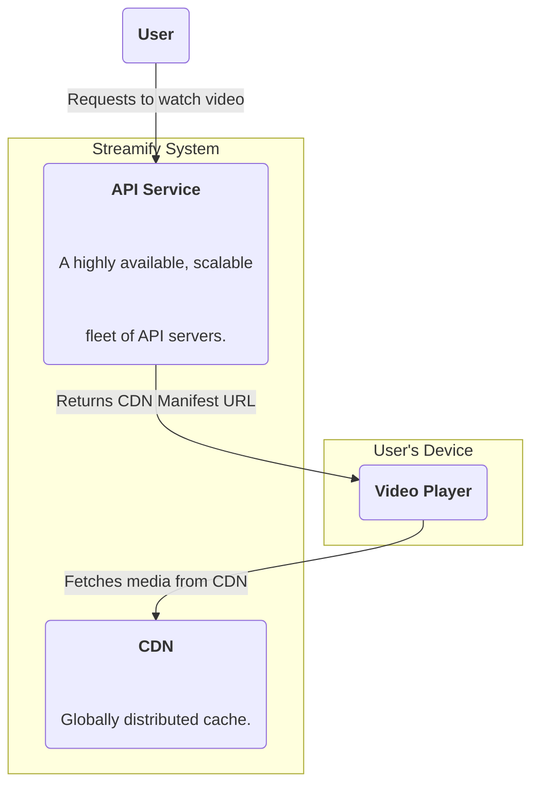
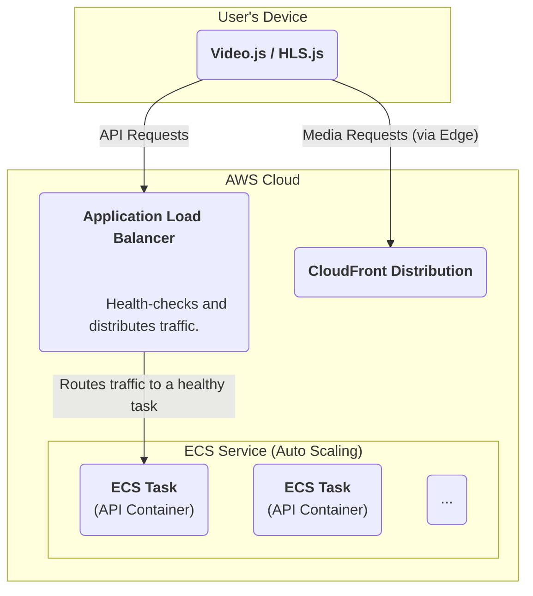

### **Achieve High Availability for the Control Plane**

Problem:
The API server, running on a single instance, is a critical single point of failure (SPOF). If this instance fails due to hardware issues, software bugs, or high load, the entire platform becomes unavailable. Users will be unable to upload new videos or start watching existing ones, directly violating our high availability requirement.

Solution:
Re-architect the API server from a single instance into a highly available, scalable service. This will be achieved by deploying multiple instances of the API server container across different physical locations (Availability Zones). An Application Load Balancer will be placed in front of this fleet to distribute incoming traffic, perform health checks, and automatically route requests away from any unhealthy instances. The entire deployment will be managed by a container orchestration service.

Trade-offs:
- Pro: Massively improves availability and reliability (NFR1) by eliminating the SPOF. Provides horizontal scalability for the API layer, allowing it to handle a much larger volume of requests.
- Con: Introduces new components and architectural complexity. Requires configuration and management of a load balancer and a container orchestration service.

### **Logical View (C4 Component Diagram)**

### **Physical View (AWS Deployment Diagram)**

### **Component-to-Resource Mapping Table**

| Logical Component  | Physical Resource                                                              | Rationale                                                                                                                                                                                                                                                   |
| :----------------- | :----------------------------------------------------------------------------- | :---------------------------------------------------------------------------------------------------------------------------------------------------------------------------------------------------------------------------------------------------------- |
| **API Service**    | **AWS ECS Service with an Application Load Balancer (ALB)**                      | **This replaces the single EC2 instance. ECS manages the lifecycle of the containers (ensuring they are running and healthy), while the ALB provides a single, stable endpoint, distributes load, and routes around failures, thus achieving high availability.** |
| Video Player       | A client-side JavaScript library (e.g., Video.js, HLS.js).                       | No change. The player interacts with a single API endpoint, unaware of the highly available infrastructure behind it.                                                                                                                                         |
| CDN                | AWS CloudFront                                                                 | No change. The API service continues to provide CloudFront URLs for media content.                                                                                                                                                                          |
