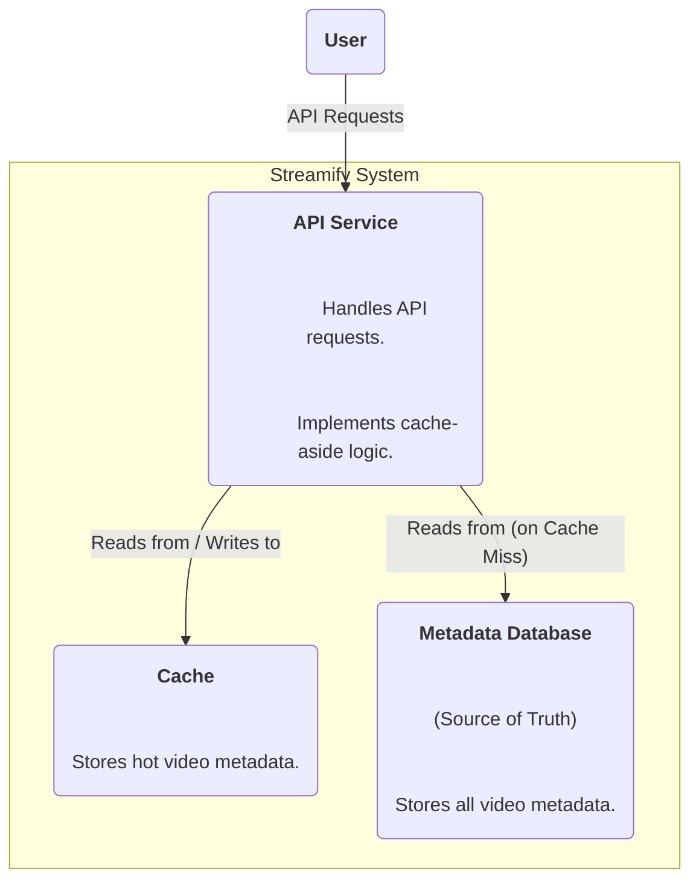
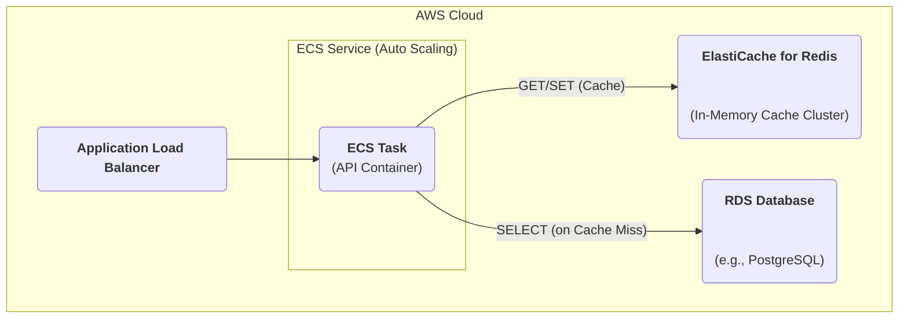
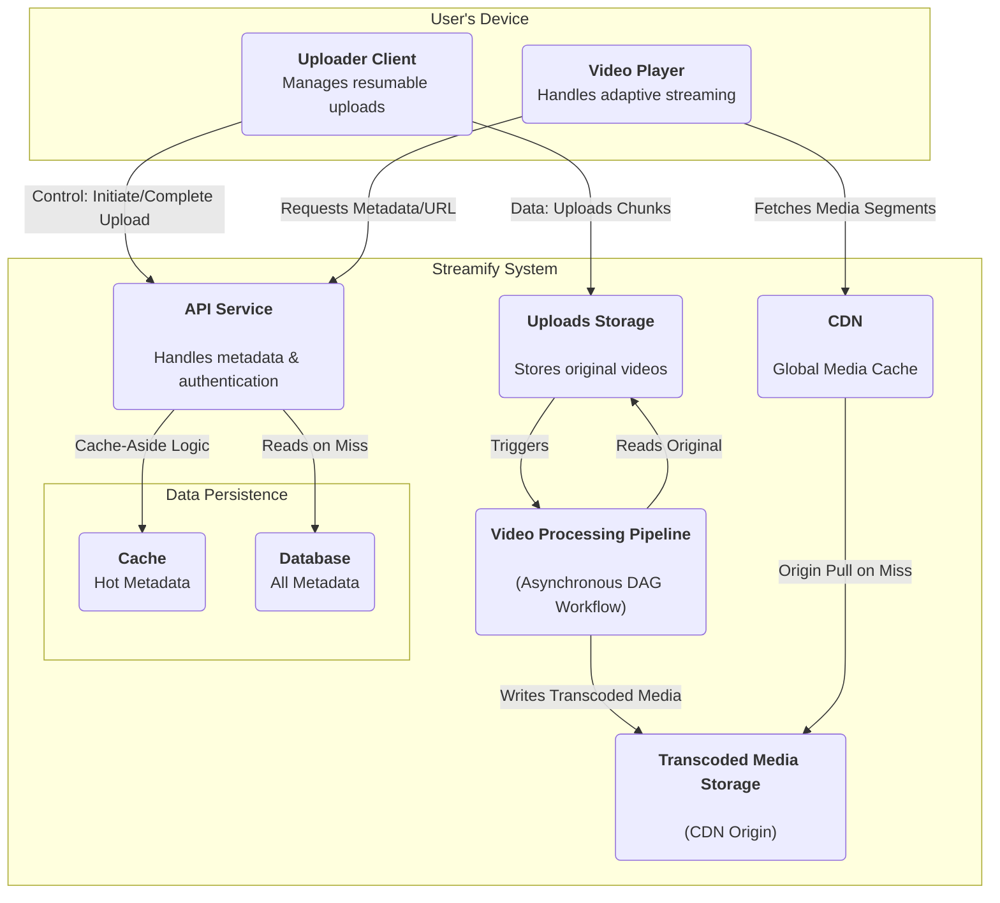
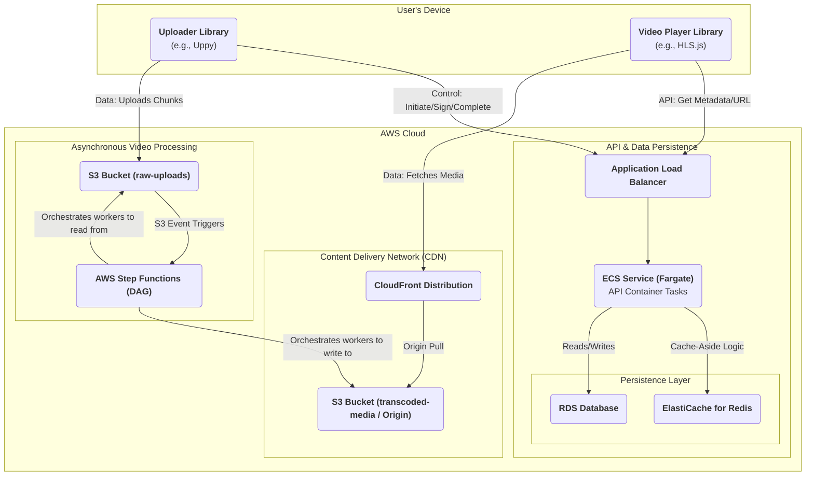

### **Add a Metadata Caching Layer**

Problem:
When a video becomes popular or goes viral, the API service receives a massive number of concurrent read requests for the same metadata (e.g., title, description, manifest URL). Routing all these requests to the primary database can create a "hotspot," overwhelming the database with redundant queries. This can lead to high latency, poor application performance, and potentially bring down the database, causing a site-wide outage.

Solution:
Introduce an in-memory caching layer between the API service and the metadata database. The data access pattern will be "cache-aside":
1.  **Request:** The API service receives a request for video metadata.
2.  **Cache-Check (Hit):** It first attempts to fetch the data from the in-memory cache. If the data exists (a cache hit), it is returned immediately with sub-millisecond latency.
3.  **Cache-Check (Miss):** If the data does not exist in the cache (a cache miss), the API service then queries the primary database.
4.  **Populate & Return:** The service returns the data to the user and simultaneously writes the data into the cache with a defined Time-to-Live (TTL), so subsequent requests will be served from the cache.

Trade-offs:
- Pro: Dramatically improves read latency for frequently accessed data. Protects the primary database from read-heavy workloads, significantly increasing the overall stability and scalability of the system.
- Con: Introduces another component that must be managed and monitored. Creates a possibility of stale data (data is updated in the database but the old version remains in the cache until its TTL expires), which requires a cache invalidation strategy for sensitive updates.

### **Logical View (C4 Component Diagram)**

### **Physical View (AWS Deployment Diagram)**

### **Component-to-Resource Mapping Table**

| Logical Component   | Physical Resource                                                              | Rationale                                                                                                                                                                                                                                                                       |
| :------------------ | :----------------------------------------------------------------------------- | :-------------------------------------------------------------------------------------------------------------------------------------------------------------------------------------------------------------------------------------------------------------------------- |
| API Service         | An AWS ECS Service with an ALB.                                                  | The API container's application logic is now updated to include the cache-aside pattern, connecting to both Redis and RDS clients to manage data retrieval.                                                                                                                   |
| **Cache**           | **Amazon ElastiCache for Redis**                                                 | **Redis is an extremely fast in-memory key-value store, making it the industry standard for caching. ElastiCache is the managed AWS offering, which handles the operational overhead of running a Redis cluster, providing high availability and scalability for our cache.** |
| **Metadata Database** | **Amazon RDS for PostgreSQL**                                                  | **RDS is a managed relational database service. It provides the durability, consistency, and transactional integrity required for our primary metadata store (video titles, user info, etc.). Using a managed service like RDS offloads database administration tasks.** |

### Overall Logical View (C4 Component Diagram)

### **Overall Physical View (AWS Deployment Diagram)**

