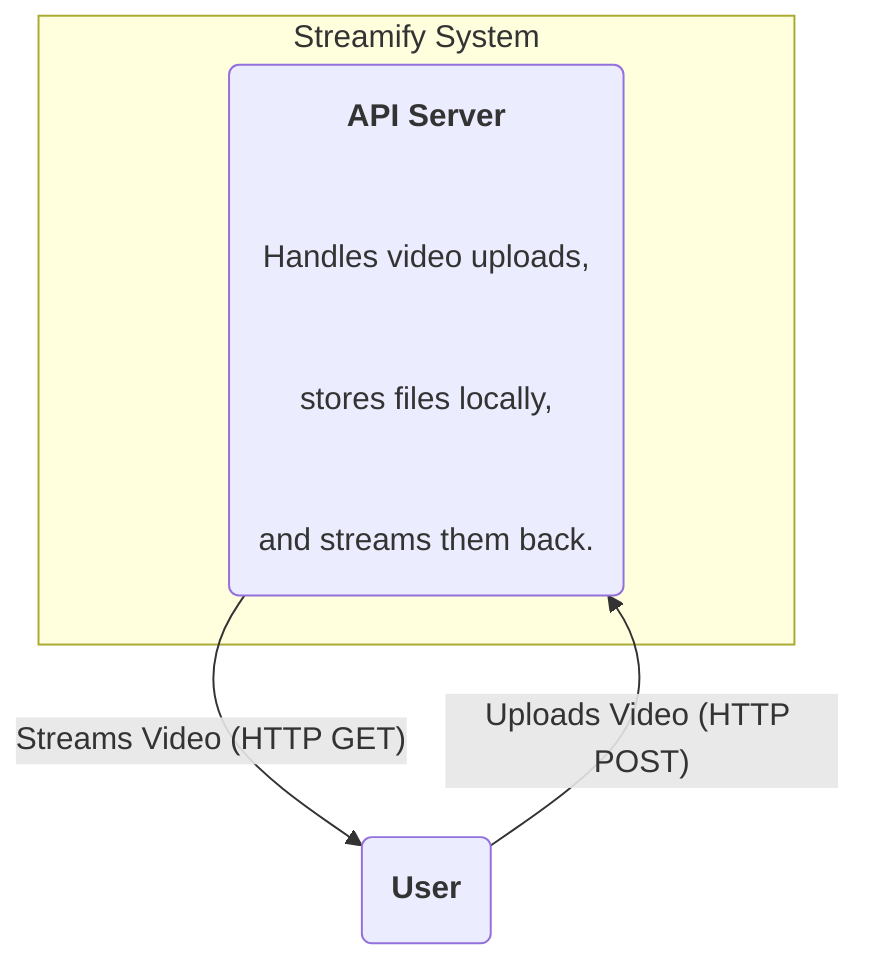
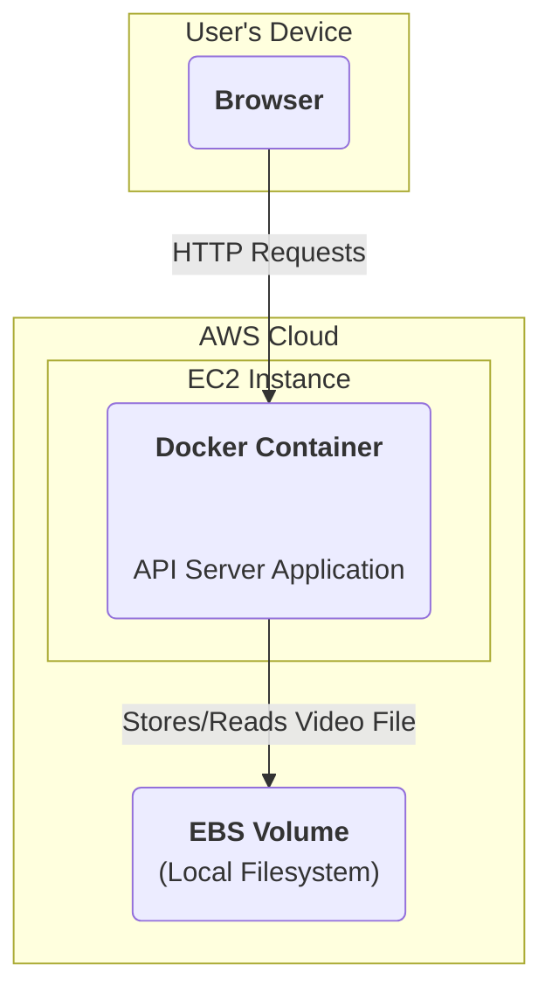

### **Logical View (C4 Component Diagram)**

### **Physical View (AWS Deployment Diagram)**

### **Component-to-Resource Mapping Table**

| Logical Component | Physical Resource                                                                             | Rationale                                                                                                       |
| :---------------- | :-------------------------------------------------------------------------------------------- | :-------------------------------------------------------------------------------------------------------------- |
| API Server        | A Docker container running on a single AWS EC2 Instance with an attached Elastic Block Store (EBS) volume. | This represents the simplest possible deployment to create a functional prototype. The EBS volume provides basic persistent storage for the single node. |
