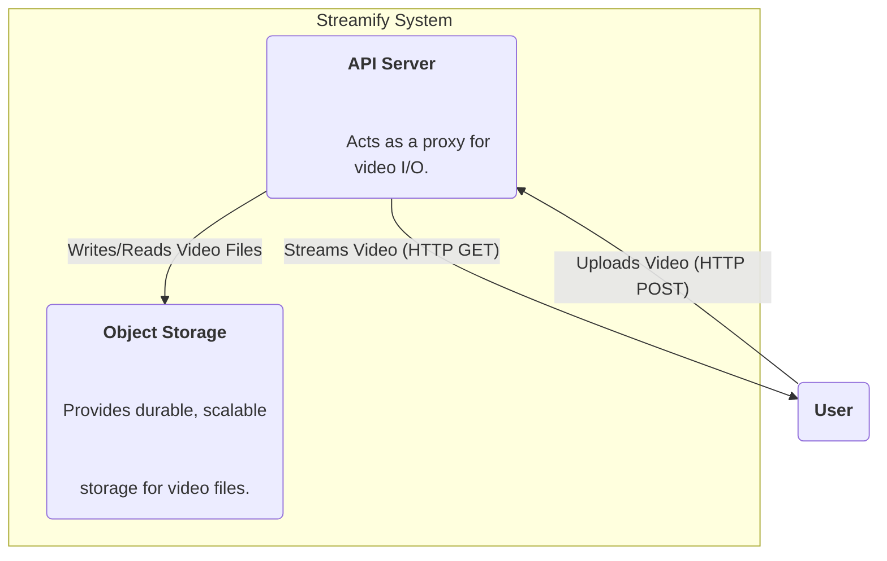
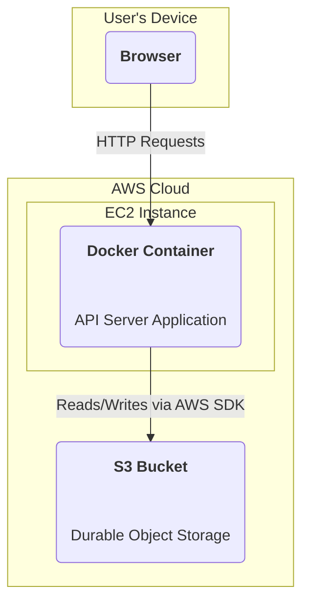

### **Logical View (C4 Component Diagram)**

### **Physical View (AWS Deployment Diagram)**

### **Component-to-Resource Mapping Table**

| Logical Component | Physical Resource                                     | Rationale                                                                                                                                                             |
| :---------------- | :---------------------------------------------------- | :-------------------------------------------------------------------------------------------------------------------------------------------------------------------- |
| API Server        | A Docker container running on a single AWS EC2 Instance. | The API server remains the single entry point. Its deployment model is unchanged for now.                                                                            |
| Object Storage    | AWS Simple Storage Service (S3)                         | S3 is the industry standard for object storage, offering 11 nines of durability, virtually infinite scalability, and a cost-effective pay-as-you-go pricing model. It perfectly matches our non-functional requirements for durability and scalability. |
