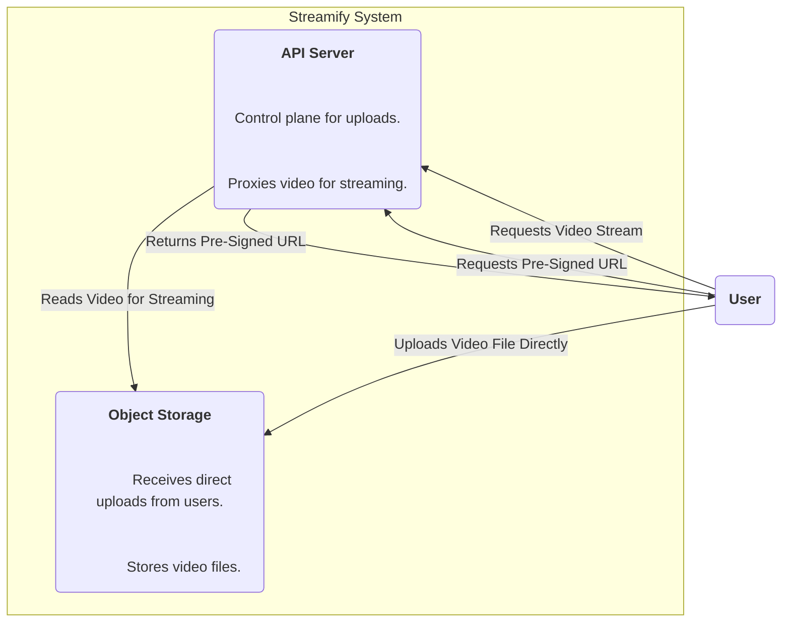
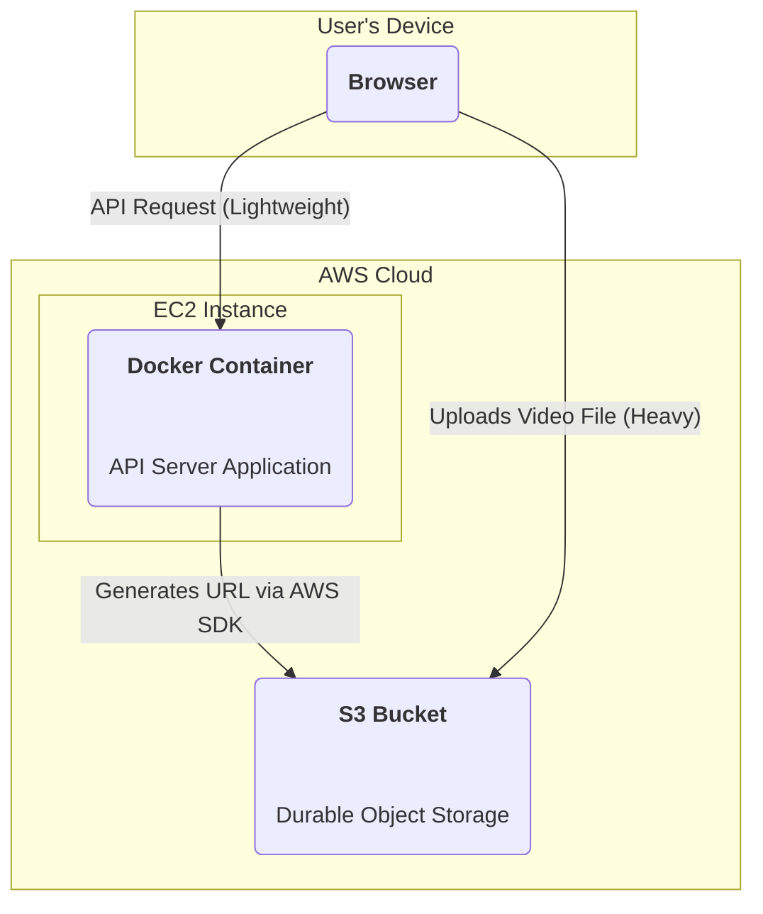

### **Logical View (C4 Component Diagram)**

### **Physical View (AWS Deployment Diagram)**

### **Component-to-Resource Mapping Table**

| Logical Component | Physical Resource                                     | Rationale                                                                                                                                                                                            |
| :---------------- | :---------------------------------------------------- | :--------------------------------------------------------------------------------------------------------------------------------------------------------------------------------------------------- |
| API Server        | A Docker container running on an AWS EC2 Instance.      | The API server's role shifts to a **control plane** for uploads. It no longer handles the video data stream during upload, only a lightweight request to authorize the action and generate a secure, temporary URL. |
| Object Storage    | AWS Simple Storage Service (S3)                         | S3's pre-signed URL feature is used to enable secure, direct-from-client uploads. This offloads the data transfer burden from our application servers, allowing the system to scale upload and API traffic independently. |
