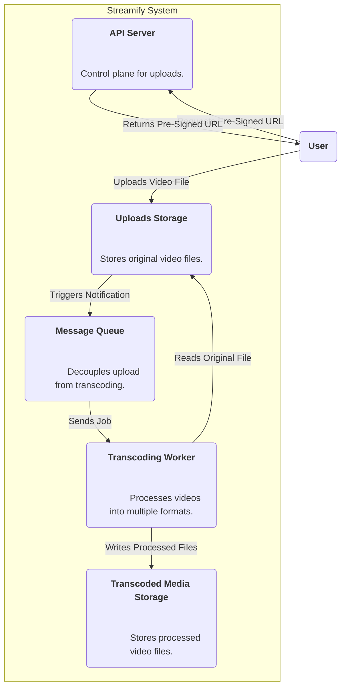
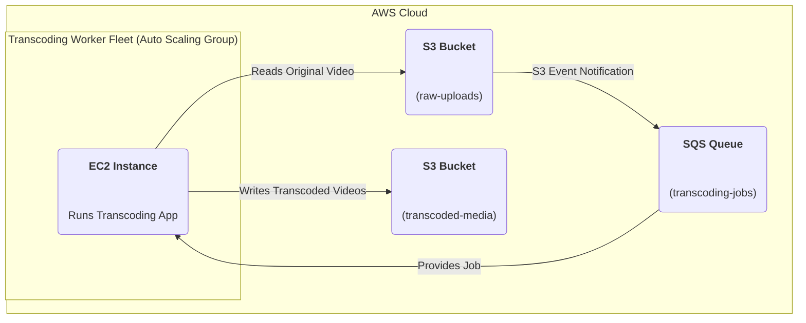

### **Logical View (C4 Component Diagram)**

### **Physical View (AWS Deployment Diagram)**

### **Component-to-Resource Mapping Table**

| Logical Component        | Physical Resource                                                                | Rationale                                                                                                                                                                                                                         |
| :----------------------- | :------------------------------------------------------------------------------- | :-------------------------------------------------------------------------------------------------------------------------------------------------------------------------------------------------------------------------------- |
| Uploads Storage          | AWS S3 Bucket (e.g., `raw-uploads`)                                                  | A dedicated bucket to store the original, unmodified video files.                                                                                                                                                                 |
| Message Queue            | AWS Simple Queue Service (SQS)                                                     | SQS is a fully managed message queuing service that is perfect for decoupling services. S3 Event Notifications can integrate directly with it, making it an ideal choice to trigger the asynchronous workflow reliably.                 |
| Transcoding Worker       | An Auto Scaling Group of EC2 Instances running the transcoding application.      | A separate fleet of compute resources is needed for the CPU-intensive transcoding tasks. An Auto Scaling Group allows the fleet to grow or shrink based on the workload (i.e., the number of messages in the SQS queue), optimizing costs. |
| Transcoded Media Storage | AWS S3 Bucket (e.g., `transcoded-media`)                                             | A separate bucket to store the output of the transcoding process. This separation keeps the original files safe and simplifies access control and lifecycle management for the different types of data.                               |
