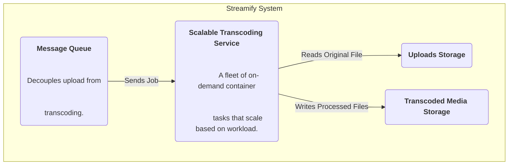
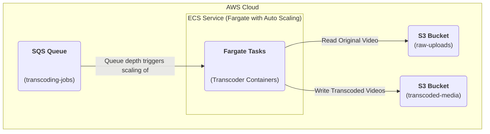

### **Implement a Scalable Transcoding Worker Fleet**

Problem:
The video transcoding workload is inherently spiky; a viral challenge could lead to thousands of uploads in a short period, followed by hours of low activity. A fixed fleet of workers would be inefficient, either being overwhelmed during peaks or sitting idle and incurring costs during lulls. While an EC2-based Auto Scaling Group provides some elasticity, the slow startup time for new EC2 instances (often several minutes) can lead to a significant backlog in the processing queue during sudden upload bursts.

Solution:
Re-architect the transcoding worker fleet to be more elastic and responsive. Instead of scaling the underlying EC2 instances, we will use a serverless container platform. The transcoding worker containers will be run as on-demand tasks managed by a container orchestrator. The service will be configured with a more aggressive auto-scaling policy tied directly to the depth of the message queue. A rapid increase in queue size will trigger the near-instantaneous launch of dozens or hundreds of new container tasks to handle the load, which will then automatically scale down to zero when the queue is empty to save costs.

Trade-offs:
- Pro: Creates a highly elastic and cost-effective processing farm (NFR3 & NFR5). Scaling response time is reduced from minutes to seconds, allowing the system to handle sudden bursts in workload gracefully. Reduces operational overhead by eliminating the need to manage the underlying server infrastructure.
- Con: Serverless container platforms may have limits on execution duration or available CPU/memory configurations, which must be considered. For sustained, predictable workloads, reserved EC2 instances might be cheaper, but for the spiky nature of this task, the on-demand model is superior.

### **Logical View (C4 Component Diagram)**

### **Physical View (AWS Deployment Diagram)**

### **Component-to-Resource Mapping Table**

| Logical Component         | Physical Resource                                                                       | Rationale                                                                                                                                                                                                                                                                                                                            |
| :------------------------ | :-------------------------------------------------------------------------------------- | :----------------------------------------------------------------------------------------------------------------------------------------------------------------------------------------------------------------------------------------------------------------------------------------------------------------------------------- |
| **Scalable Transcoding Service** | **An AWS ECS Service configured with the Fargate launch type and Service Auto Scaling.** | **This replaces the EC2 Auto Scaling Group. Fargate allows us to run containers without managing servers or clusters. By using Fargate with an auto-scaling policy based on the SQS queue depth (via CloudWatch Alarms), we get a highly elastic, serverless, and cost-efficient solution that can scale from zero to thousands of tasks in seconds.** |
| Message Queue             | AWS Simple Queue Service (SQS)                                                            | No change. SQS remains the durable buffer for transcoding jobs.                                                                                                                                                                                                                                                                      |
| Uploads Storage           | AWS S3 Bucket (e.g., `raw-uploads`)                                                         | No change.                                                                                                                                                                                                                                                                                                                          |
| Transcoded Media Storage  | AWS S3 Bucket (e.g., `transcoded-media`)                                                    | No change.                                                                                                                                                                                                                                                                                                                          |
