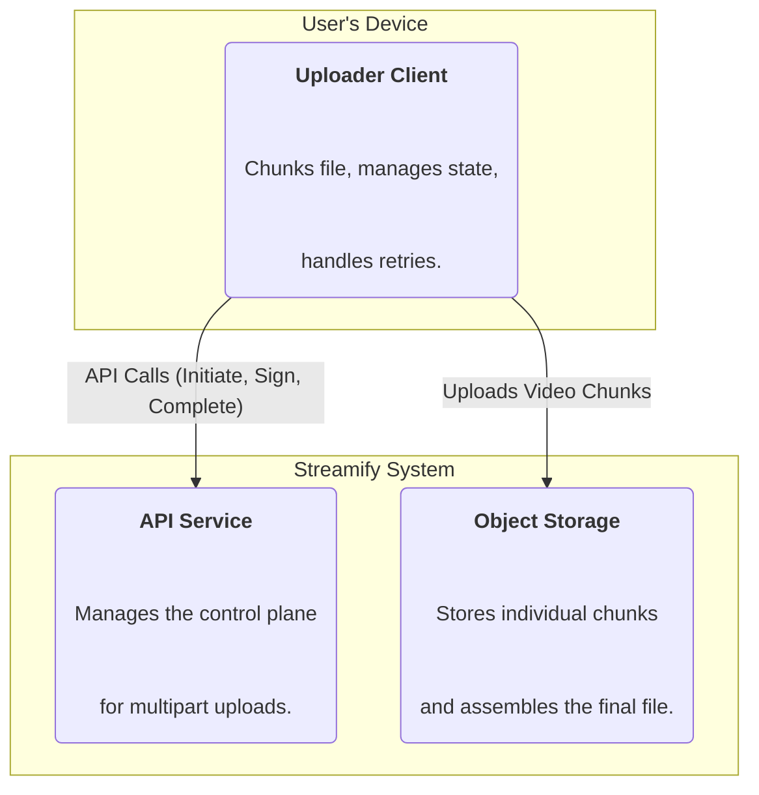
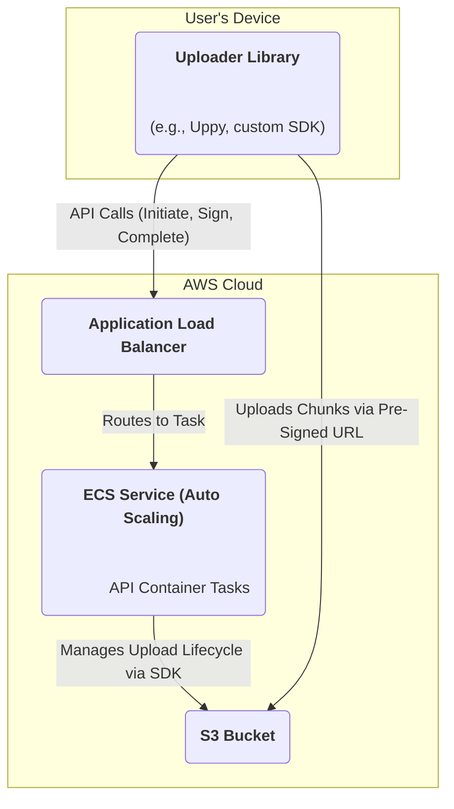

### **Implement Resumable Uploads**

Problem:
Users uploading large video files, especially over unstable connections like mobile networks, frequently face interruptions. Without a resumable mechanism, any network drop forces the user to restart the entire multi-gigabyte upload from the beginning. This creates a frustrating and often unusable experience, failing to meet a key functional requirement (FR2).

Solution:
Implement a robust resumable upload system by leveraging the native multipart upload functionality of the object storage service. The upload process will be re-architected into a stateful, multi-step interaction:
1.  **Chunking:** The client splits the video file into smaller, numbered chunks (e.g., 5-10 MB each).
2.  **Initiate:** The client makes a lightweight API call to the API server to initiate a multipart upload. The server creates the session with the object store and returns a unique `UploadId`.
3.  **Sign & Upload:** For each chunk, the client requests a pre-signed URL from the API server for that specific chunk number and `UploadId`. The client then uploads the chunk directly to the object store.
4.  **Resume:** If the upload is interrupted, the client can query the API server to determine which chunks were successfully uploaded and can resume by only uploading the remaining chunks.
5.  **Complete:** Once all chunks are successfully uploaded, the client sends a final `complete` request to the API server, which then instructs the object store to assemble the chunks into a single file.

Trade-offs:
- Pro: Dramatically improves the reliability and user experience for large file uploads, making the system viable for users on less-than-perfect networks.
- Con: This introduces significant complexity to the system. The API server must now manage the stateful lifecycle of uploads (initiate, sign, complete, abort), and the client-side application requires sophisticated logic for chunking, state tracking, and retries.

### **Logical View (C4 Component Diagram)**

### **Physical View (AWS Deployment Diagram)**

### **Component-to-Resource Mapping Table**

| Logical Component  | Physical Resource                                                              | Rationale                                                                                                                                                                                                                                                                                       |
| :----------------- | :----------------------------------------------------------------------------- | :---------------------------------------------------------------------------------------------------------------------------------------------------------------------------------------------------------------------------------------------------------------------------------------------- |
| Uploader Client    | A sophisticated client-side JavaScript library (e.g., Uppy) or a custom mobile/desktop SDK. | This is more than a simple HTTP client. It must handle file I/O for chunking, maintain a state machine for the upload process (which chunks have been uploaded), and implement retry logic.                                                                          |
| API Service        | An AWS ECS Service with an Application Load Balancer (ALB).                      | The API server's role expands to become a stateful manager for the multipart upload lifecycle. It handles `initiate`, `sign part`, `complete`, and `abort` requests, interacting with S3's Multipart Upload APIs via the AWS SDK.                                     |
| Object Storage     | AWS S3 Bucket                                                                  | **S3's native Multipart Upload feature is the core technology enabling this entire workflow.** It provides the APIs to manage the lifecycle of a chunked upload, temporarily stores the individual parts, and performs the final, efficient server-side assembly of the file. |
